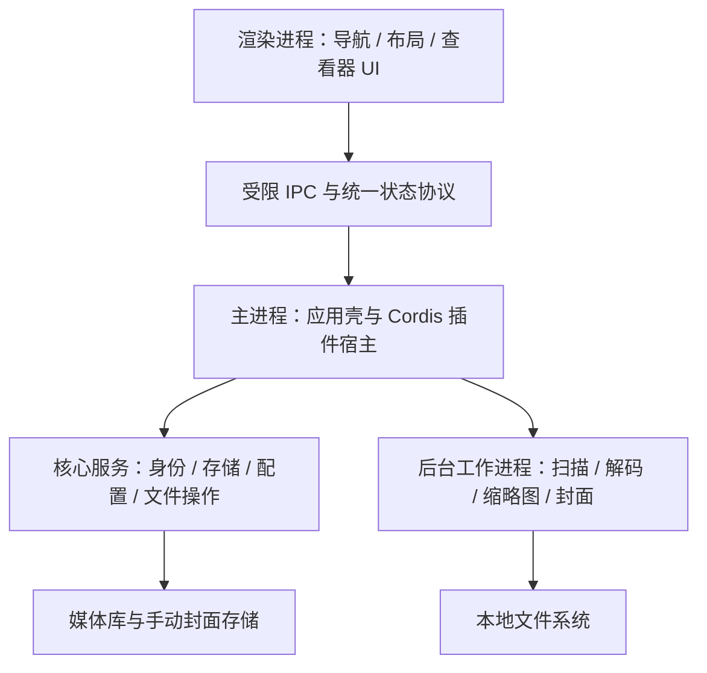

# 本地多媒体管理工具 PRD

| 项目 | 内容 |
| --- | --- |
| 产品代号 | VideoManager（暂定，管理图片与视频） |
| 文档版本 | V1.0 · 需求评审稿 |
| 更新日期 | 2026-09-18 |
| 首发平台 | Windows 桌面端 |
| 技术约束 | Electron 应用框架 + Cordis 功能插件体系 |
| 设计规模 | 单媒体库 1 万～10 万个媒体文件 |
| 文档用途 | 产品、设计、研发与测试对齐；文中性能数字为验收目标，尚非实测结果 |

## 1. 产品定义与需求基线

**一款直接连接本地磁盘与文件夹，以封面识别目录、以连续视图浏览媒体、以插件配置使用方式的本地多媒体管理工具。**

产品保留真实文件结构，不要求用户先导入副本或重新整理目录。通过“文件夹集合 + 当前目录媒体”的分区视图，以及可随时切换的跨层总览，让用户看得见内容、辨得清位置、找得到下一项。

### 1.1 已确认的产品决策

| 决策 | 确认内容 |
| --- | --- |
| 规模与框架 | 首版按 1 万～10 万个文件设计，采用 Electron |
| 文件管理范围 | 浏览、图片查看、视频播放、搜索筛选、收藏、标签、封面管理、重命名、移动、移入回收站 |
| 默认浏览方式 | 当前目录的子文件夹集合与直属图片／视频分区展示 |
| 跨层浏览 | 可显示当前目录及全部后代目录的媒体；保留来源路径，支持定位所在目录 |
| 插件化 | 基于 Cordis；路径展示、媒体内容展示等实际功能模块均可作为插件配置 |
| 封面 | 自动封面不使用 AI；支持自定义图片和用户自行选择视频中的一帧 |

### 1.2 本版采用的设计边界

面向个人本地媒体收藏与素材浏览场景；核心功能离线可用，无账号依赖，不主动上传媒体。Windows 为首版交付平台，macOS 为后续适配方向。Electron 官方支持 Windows、macOS、Linux 桌面平台；Android 需要单独的客户端与系统能力适配，不计入同一 Electron 客户端的交付承诺。[Electron 官方说明](https://www.electronjs.org/docs/latest)

媒体仅在用户执行文件操作时发生变更；扫描、收藏、打标签、生成封面均写入应用管理数据，不修改原媒体。产品不自动推断文件夹的语义类别，不进行云同步、视频剪辑、转码或自动重排原文件。

## 2. 用户痛点、设计解法与目标

| 痛点 | 设计解法 | 可验证目标 |
| --- | --- | --- |
| 同一目录混合子目录、图片和视频，需要反复进入与返回 | 目录与媒体分区；文件夹快速预览；可视化同级目录切换 | 相较系统文件管理器，典型找图／找视频任务的中位完成时间降低 30% |
| 想连续看内容时，目录层级打断浏览 | “当前目录／包含子目录”显式切换；图片与视频共用浏览队列 | 开启跨层总览只需一次操作；无需逐层进入目录 |
| 文件夹名称难以唤起内容记忆，普通图标缺乏辨识度 | 自动封面、内容计数、手动选图和视频选帧 | 至少 80% 的测试用户能在不进入目录的情况下识别目标集合 |
| 固定界面难以适应不同浏览习惯 | 路径导航与内容布局分别插件化 | 更换任一展示插件后，位置、筛选与有效选中项不丢失 |
| 移动目录、更换磁盘后，收藏与封面容易失联 | 稳定内部标识、根目录重绑、可迁移管理数据 | 对可验证匹配的条目，迁移后标签、收藏与手动封面完整恢复 |

可用性验证采用至少 8 名目标用户、相同媒体集和配对任务，轮换工具使用顺序。以上为待验证目标，不作为已完成的用户研究结论。验证通过观察和本地测试日志完成，不要求上传日常使用记录。

## 3. 版本范围

P0 为首版上线必备；P1 为首版后迭代；P2 为探索方向。P0 内部可分阶段开发，但不能用后续规划替代已确认功能。

| 能力 | P0 首版 | 后续范围 |
| --- | --- | --- |
| 资源接入 | 选择磁盘或文件夹、多资源根目录、增量索引、离线识别 | P1：网络共享目录专项适配 |
| 路径展示 | 封面文件夹卡片、目录树、可展开路径导航、目录快速预览 | P1：更多导航插件 |
| 内容展示 | 分区视图、跨层总览、卡片网格与详细列表两种布局 | P1：瀑布流、时间轴、并排对比 |
| 查看与播放 | 图片查看、支持格式的视频播放、来源定位 | P1：更多格式解码插件 |
| 组织与查找 | 文件名／路径搜索、条件筛选、标签、收藏、排序 | P1：保存搜索、重复文件识别 |
| 封面 | 本地自动候选、指定图片、视频选帧、裁剪、恢复自动 | P1：自定义候选策略插件；AI 不属于本版范围 |
| 文件操作 | 单项重命名、单项／批量移动、移入系统回收站 | P1：批量重命名、应用内恢复操作 |
| 插件配置 | 内置功能插件启停、配置、切换、依赖检查、故障回退；开发模式加载本地插件 | P1：第三方分发与升级机制；公开插件市场另行立项 |
| 数据与迁移 | 本地持久化、管理数据导出／导入、根目录重绑 | P1：macOS 客户端；P2：Android 独立客户端 |

## 4. 核心概念与信息架构

### 4.1 统一术语

| 术语 | 定义 |
| --- | --- |
| 媒体库 | 一组资源根目录及其索引、标签、收藏、封面和设置；不等于媒体文件副本 |
| 资源根目录 | 用户选定的磁盘或文件夹，是扫描与导航的边界 |
| 文件夹集合 | 对真实文件夹的视觉呈现；名称、层级与原目录一致，不额外创建物理目录 |
| 当前目录 | 用户当前打开的真实目录 |
| 直属媒体 | 直接位于当前目录中的图片或视频 |
| 跨层总览 | 当前目录与全部后代目录中媒体的合并结果，不包含文件夹卡片 |
| 展示插件 | 负责路径导航或内容布局的可替换功能模块，不持有媒体索引的唯一副本 |
| 手动封面 | 用户主动保存的图片快照及其来源记录，优先级高于自动封面 |

### 4.2 主界面结构

```text
┌──────────────┬─────────────────────────────────────────────┐
│ 媒体库       │ 后退 / 前进   资源根 > 旅行 > 杭州 ▾   搜索   │
│ 资源根目录   │ 当前目录 / 包含子目录    筛选  排序  视图     │
│ 目录导航     ├─────────────────────────────────────────────┤
│              │ 子文件夹集合  3                              │
│ 收藏         │ [西湖·封面] [街拍·封面] [视频素材·封面]       │
│ 标签         ├─────────────────────────────────────────────┤
│              │ 当前目录媒体  图片 12 / 视频 4                │
│              │ [图片] [视频 02:31] [图片] [视频 00:48] …    │
│ 插件与设置   ├─────────────────────────────────────────────┤
│ 后台任务     │ 已显示数量 / 索引状态 / 当前选择              │
└──────────────┴─────────────────────────────────────────────┘
```

详情、目录快速预览、封面编辑按需使用侧面板或独立对话框，避免常驻面板挤压媒体区域。

### 4.3 三个核心交互

1. **可视化路径导航：**点击路径节点返回祖先目录；点击节点后的展开按钮，以带封面的小卡片选择其子目录。展开当前目录的父节点即可在同级目录间切换，保留共同路径上下文。
2. **文件夹快速预览：**选中文件夹按空格或点击“预览”，侧面板展示最多 12 项直属媒体、子目录入口与计数；不改变当前路径和历史。按 Esc 关闭，点击“进入文件夹”才进行导航。
3. **跨层浏览与来源定位：**切换“包含子目录”后连续浏览全部媒体；每项显示相对来源路径。点击“定位所在目录”打开实际父目录、恢复当前目录模式并高亮该媒体；后退可回到原总览位置。

例如，`旅行/杭州` 同时包含 `西湖/`、`街拍/`、`合影.jpg`、`夜景.mp4`：默认上区展示两个目录集合，下区展示两个媒体；开启跨层总览后，后代媒体加入同一结果集，原文件结构保持不变。

## 5. 功能需求

### FR-01 资源接入与索引

- 用户通过系统选择器添加磁盘或文件夹；添加前展示读取范围与默认排除项，添加后立即进入该位置。
- 默认递归发现媒体，但界面先展示当前目录，再处理后代索引。基本目录项、媒体元数据、缩略图、文件夹封面分阶段完成，不等待整库处理完毕才允许浏览。
- 同一媒体库不重复注册相同或相互包含的资源根目录。遇到已有上级根目录时直接定位；添加已有根目录的上级时，提供合并纳管预览并保留原条目的管理数据。
- 默认跳过隐藏目录、系统目录和符号链接／目录联接；在扫描配置中显示排除项。首版不递归跟随链接，防止循环与越出选定范围。
- 支持暂停、继续、取消扫描与手动刷新；显示“已发现／已处理／失败”数量，发现阶段不得展示虚假的固定百分比。
- 检测外部新增、修改、删除与重命名，并通过目录复核纠正文件监听遗漏。未完成扫描、权限拒绝或磁盘离线不能被解释为文件已删除。
- 磁盘离线时保留索引、缓存封面与组织信息，显式标记“离线”；禁用原文件读取与修改操作，重新连接后增量校验。
- “移除资源根目录”仅取消纳管；对话框说明管理信息的处理方式，不调用原文件删除。默认保留管理记录供重新添加时恢复。

**验收：**添加一个混合目录后可在索引期间浏览已发现项目；断开磁盘不会清空标签、收藏或封面；重复添加不会产生重复媒体条目。

### FR-02 目录与媒体分区展示

| 规则 | 产品行为 |
| --- | --- |
| 默认模式 | 上区为直接子文件夹集合，下区为直属图片与视频；两个区使用清晰标题与独立计数 |
| 目录卡片 | 显示封面、目录名、直属图片／视频数、直接子目录数；悬浮或详情显示含后代媒体总数 |
| 媒体卡片 | 显示缩略图、文件名、类型；视频额外显示时长；收藏与选中状态不依赖颜色单独表达 |
| 跨层总览 | 只展示当前目录及后代媒体，每个文件条目出现一次；显示来源路径，不把文件夹混入媒体队列 |
| 布局切换 | 卡片网格与详细列表共用结果、排序和选择；展示插件只能改变呈现，不得隐式改变搜索范围 |
| 空目录 | 无直属媒体时显示“当前目录暂无图片或视频”；有子目录时提供“查看全部子目录媒体”入口 |
| 非媒体文件 | 默认不进入媒体列表；详情显示其他文件计数，涉及整目录操作时必须计入影响范围 |
| 未完成索引 | 未知数量显示“统计中”，不显示 0；已知数量注明扫描未完成 |

默认按名称自然排序，文件夹区与媒体区分别排序；支持修改时间、大小等排序，视频可按时长排序，缺失值放在末尾。后台元数据或封面更新不改变当前排序字段时，不得导致卡片跳位。

状态按媒体库、目录和浏览模式保存，包括展示插件、排序、筛选、滚动锚点与有效选中项。返回页面恢复到原项目附近，不依赖易变化的像素偏移。

### FR-03 选择、导航与查看

- 单击选中；双击或 Enter 进入目录／打开媒体；空格快速预览；Esc 关闭预览或退出当前查看层。
- 支持 Ctrl 多选、Shift 范围选择、Ctrl+A 选择当前结果集。界面明确展示选中总数；结果数量尚未稳定时禁用跨结果全选。
- 前进／后退保存路径、搜索上下文与浏览状态；Alt+↑ 返回父目录，到达资源根后停止，不擅自进入未纳管位置。
- 图片与视频共用当前筛选、排序后的查看队列，排除文件夹；查看器可切换上一项／下一项。新进入的视频默认暂停，由用户播放。
- 图片支持适应窗口、原始比例、缩放、拖动、全屏与临时旋转；临时旋转不修改原图。
- 视频支持播放／暂停、进度定位、音量、倍速、全屏、续播记录与进入封面选帧。切换媒体时释放上一个播放器资源，不并发输出声音。
- 提供“复制路径”“在系统文件管理器中显示”“使用系统默认应用打开”；错误项保留条目与失败原因，不出现无限加载状态。

**首版格式合同：**

| 类型 | P0 验收范围 | 范围外处理 |
| --- | --- | --- |
| 图片 | JPEG、PNG、WebP、GIF、BMP；GIF 支持动态查看，封面使用静态画面 | HEIC、RAW、TIFF 等由后续解码插件扩展，显示明确的不支持提示 |
| 内置视频播放与选帧 | MP4（H.264 + AAC）、WebM（VP8／VP9 + Opus／Vorbis）测试样本必须通过 | 不按扩展名承诺全部编码可播放；同容器的不同编码需探测 |
| 其他视频发现 | MOV、MKV、AVI 等常见视频可被发现、搜索和执行文件管理 | 可解码则生成缩略图；无法内置播放时提供外部打开和自定义图片封面 |

实际解码组件及发行构建须在 M0 验证上述合同；播放、缩略图、选帧分别检测能力，不能因其中一项可用就声明另外两项受支持。

### FR-04 搜索、筛选与组织

| 能力 | 规则 |
| --- | --- |
| 搜索范围 | 默认遵循当前模式：当前目录或包含子目录；可显式切换为整个媒体库，搜索框持续显示范围 |
| 文本搜索 | 支持文件／目录名称和相对路径，不区分拉丁字母大小写；多个词按同时包含匹配；不承诺图片内容识别 |
| 条件筛选 | 图片／视频类型、扩展名、标签、收藏、修改日期、大小；视频额外支持时长 |
| 条件组合 | 不同维度按 AND；同一类型或扩展名维度内按 OR；多个标签默认“全部包含”，界面显示该规则 |
| 搜索结果 | 目录结果与媒体结果分组；跨路径媒体显示来源；“定位所在目录”临时清除妨碍定位的筛选，后退恢复原搜索 |
| 收藏 | 文件夹和媒体均可收藏；收藏目录不自动收藏后代媒体 |
| 标签 | 可对文件夹与媒体新增、移除和批量应用标签；目录标签不自动继承给文件；修改仅写入应用数据库 |
| 批量操作 | 对发起时的结果快照执行，不将扫描中新出现的文件自动纳入本次选择 |

无结果时显示当前范围和有效条件，并提供清空筛选入口。索引未完成时明确告知搜索结果暂不完整。

### FR-05 文件夹与视频封面

#### 5.5.1 封面对象与优先级

文件夹集合和单个视频均支持独立封面；图片条目默认展示原图缩略图。文件夹封面是一张代表图，视频封面是一张静态预览图，均不嵌入或改写源文件。

优先级固定为：**用户手动封面 > 已保存的自动封面 > 类型占位图**。手动封面仅在用户选择“恢复自动封面”后解除锁定；扫描、重启、策略更换、新媒体加入均不得覆盖。

#### 5.5.2 自动初始化：本地处理，不使用 AI

1. 优先从文件夹直属的可解码图片和视频中产生候选；没有合格候选时，从已索引后代中按较浅层级优先补充。单个视频只从自身生成候选。
2. 从候选图片和视频分散取样，初始预算为每个文件夹最多 24 张图片、4 个视频、每个视频最多 8 帧。视频避开明显片头／片尾区域，短视频按实际时长自适应，不把固定秒数用于所有视频。
3. 按清晰度、曝光、黑屏／纯色占比和封面裁剪可用性筛选；保留最多 6 个候选。该方法只评估画面质量，不宣称理解剧情或识别“精彩时刻”。
4. 首个可用候选即可作为自动封面；当前文件夹可在本次候选任务完成后更新一次。后台新增媒体不得反复替换已稳定的封面，用户可主动“重新推荐”。
5. 封面任务优先处理当前可见目录；到达单目录 10 秒处理预算时先返回已有候选，未完成任务可稍后重试。失败使用占位图，不能阻塞浏览或拖慢整个目录索引。

候选不足 6 个时展示实际数量。视频损坏、全部画面质量较低、目录无媒体或磁盘离线时分别说明原因，不伪装成已生成的封面。取样预算和评分参数属于可调策略，不作为最终算法实现限制。

#### 5.5.3 用户从视频中选择一帧


| 环节 | 具体行为 |
| --- | --- |
| 入口 | 文件夹／视频右键菜单、详情面板、播放器“设为封面” |
| 选择来源 | 默认列出当前文件夹及后代的视频；可选择其他本地视频。视频自身的封面编辑默认打开该视频 |
| 时间定位 | 支持拖动时间轴、输入时间点、播放后暂停、前一帧／后一帧微调；显示实际解码帧的时间戳 |
| 画面一致性 | 以实际解码帧作为预览和保存源；变帧率视频不按假定固定帧率换算；精确定位失败时保留最后成功帧并提示 |
| 裁剪 | 提供封面比例预览、平移、缩放及“完整显示”；默认比例 16:10，切换布局可使用同一原始快照重新适配 |
| 保存对象 | 从文件夹入口进入时默认设置该文件夹；从播放器进入时可选当前视频或其所在文件夹，保存前显示目标名称 |
| 保存 | 快照文件持久化成功后再提交封面记录；保存成功立即刷新，旧封面在失败时继续有效 |
| 取消 | 关闭或取消不更改已生效封面；保存后支持在编辑器内重新选帧与调整裁剪 |

精确选帧必须使用能返回实际解码帧的实现；不能只修改播放器进度后立即截取尚未更新的画面。选帧体验属于 P0，不能以“后续插件实现”替代。

#### 5.5.4 其他自定义方式与生命周期

- 支持从当前目录／后代图片中选择，或通过系统选择器指定外部本地图片；同样提供裁剪和预览。
- 手动封面保存原始选定画面的独立快照、裁剪参数、来源标识、原视频时间戳和设置时间；清理可再生缓存不能删除手动封面。
- 原媒体重命名或在应用内移动时，更新来源引用；手动快照保持不变。来源被删除或移出目录后保留手动快照，编辑器标注“来源已不可用”或“来源不在此目录”。
- 自动封面来源不再属于该目录子树或确已删除时，重新推荐；仅磁盘离线或扫描未完成时保留原封面，不立即替换。
- “恢复自动封面”需明确提示会替换当前手动设置；自动候选准备成功后再切换，生成失败时继续保留手动封面。
- 无法解码的视频仍可指定图片作为封面；不将外部播放器支持误认为应用内可以选帧。

**验收：**用户暂停并微调到任意受支持视频帧后，保存结果与预览画面一致；重启、重扫、切换封面策略及源文件移动后，手动封面保持不变。

### FR-06 文件重命名、移动与回收站

全部操作经统一文件操作服务执行。入口插件不直接修改数据库中的路径来模拟文件操作；成功以实际文件系统结果为准，数据库更新失败时可通过操作日志恢复一致性。

| 操作 | P0 规则 | 失败与恢复 |
| --- | --- | --- |
| 重命名 | 支持单个媒体和文件夹；校验非法字符、保留名称和同名冲突；默认只编辑文件主名 | 不覆盖同名目标；文件被占用或无权限时保留原名称；目录成功后更新全部后代路径 |
| 移动 | 支持单项、批量及整个文件夹；目标为已纳管目录，未纳管目标可在窗口中先添加再继续 | 同名时选择保留两者、跳过或取消；首版不提供静默覆盖；禁止移入自身或后代目录 |
| 跨磁盘移动 | 后台执行复制、内容校验、删除源文件；每项独立记录结果 | 校验成功前不得删除源；失败或中断保留至少一个有效副本；复制成功但源删除失败须明确提示“两处均保留” |
| 移入回收站 | 对选中项显示数量、路径及整目录影响后确认；调用系统回收站能力 | 回收站不可用或调用失败则停止该项并保留源文件，不转为永久删除 |
| 操作记录 | 显示成功／失败／跳过、当前位置与可执行的重试动作 | 不把部分成功显示为全部成功；首版不承诺应用内一键撤销或回收站恢复 |

补充规则：

- 移动目标先检查写入权限、可用空间及路径冲突；真实执行时再次校验，处理预检后的变化。
- 批量选中父目录及其后代时合并为不重复的操作集合。整个目录操作包含隐藏文件和非媒体文件；确认界面必须说明这一点，数量无法完整读取时标为未知。
- 用户取消批量操作时，在安全边界停止后续项，保留已完成项并报告结果；不声称整批原子回滚。
- 应用内重命名／移动保留媒体与目录内部标识，因此收藏、标签、播放记录和手动封面随对象迁移。
- 正在播放或解码的文件发生变更前，先释放相关句柄；磁盘离线、权限不足或来源已改变时重新校验，不继续使用过期路径。
- 移入回收站后隐藏活动条目，保留管理关联。系统恢复后经身份校验恢复关联；同路径出现的不同文件不能直接继承旧标签或封面。
- 资源根目录自身不通过普通条目操作重命名或移动；使用系统完成实际搬迁后，通过根目录重绑恢复连接。

Electron 提供将路径送入系统回收站的 API；能否成功需以调用结果为准。应用内恢复不是该 API 提供的功能。[Electron shell 文档](https://www.electronjs.org/docs/latest/api/shell)

### FR-07 功能插件与配置中心

#### 5.7.1 插件化原则

**插件化必须让用户看得见功能差异。**路径导航样式与媒体内容布局可以独立更换；搜索、封面策略、播放器等通过一致的服务和状态协作。安装应用后默认启用一套可用组合，无需用户先理解 Cordis。

| 功能域 | 内置实现／扩展点 | 配置与卸载规则 |
| --- | --- | --- |
| 路径导航 | 目录树、可视化路径导航；扩展导航呈现器 | 样式可替换；至少保留内置基本导航 |
| 媒体内容布局 | 卡片网格、详细列表；扩展内容布局 | 同一内容区域一次启用一个布局；不更改结果语义 |
| 媒体查看器 | 图片查看、视频播放；按媒体能力注册处理器 | 多个处理器可存在；用户选择默认项，失败时提示可用替代项 |
| 缩略图与解码 | 图片缩略图、视频探测／抽帧 | 后台任务可取消并释放资源；故障不影响目录列表 |
| 封面策略与编辑器 | 非 AI 自动选图、图片选择、视频选帧与裁剪 | 自动策略可替换；手动封面与历史数据由核心存储持有 |
| 搜索与组织 | 搜索、筛选、标签、收藏 | 可配置功能入口；停用后保留索引与用户数据 |
| 文件操作入口 | 重命名、移动、回收站菜单及操作窗口 | 停用入口不终止已进入提交阶段的操作；核心操作服务继续收尾 |
| 资源与索引 | 本地资源提供器、文件监听、索引服务 | 作为基础插件管理，运行中的媒体库不允许直接卸载必需依赖 |

核心保留应用启动、媒体身份、持久化、文件操作事务、IPC 校验、任务协调和最小恢复界面。将它们全部开放为可随意卸载的模块会使用户无法恢复应用，因此首版不提供此类开关。

#### 5.7.2 插件配置交互

1. 配置中心按“导航、内容展示、查看与播放、封面、组织、文件操作”分组，展示名称、版本、启用状态、依赖与可配置项。
2. 路径与布局插件提供预览和应用；切换后恢复目录、模式、搜索、筛选、排序、选中项与滚动锚点。新布局无法保留精确位置时定位到同一媒体。
3. 启用前检查宿主接口版本、平台能力、依赖和槽位冲突。缺少依赖时说明原因；可替代插件只有在用户选择后才接管同一槽位。
4. 停用显示受影响功能；存在活动任务时等待当前安全步骤结束，或允许取消可取消的任务。界面显示等待原因，不强制中断文件提交。
5. 配置校验失败不覆盖旧配置；启动失败回滚到上一可用组合。展示插件异常时自动启用内置基础布局，并提供恢复默认配置入口。
6. 停用与卸载均不自动删除标签、收藏或封面；插件私有数据的删除须作为独立且明确的操作。

插件清单须声明唯一标识、版本、宿主接口兼容范围、支持平台、依赖、贡献槽位、配置结构和所需宿主能力。配置中心由这些声明生成基础表单；复杂交互可由插件提供专用页面。

#### 5.7.3 Cordis 与进程边界

Cordis 承担插件注册、服务依赖和生命周期管理；插件通信、UI 槽位、数据持久化及故障恢复由本产品定义。Cordis 提供的作用域与生命周期机制不能直接等同于安全沙箱。其上游提示 API 仍可能变化，研发须在 M0 固定依赖版本，并通过产品适配层稳定插件接口。[Cordis 上游仓库](https://github.com/cordiverse/cordis)、[Cordis 核心包文档](https://www.npmjs.com/package/%40cordisjs/core)



- 插件在宿主注册能力与 UI 入口，由宿主协调渲染端挂载和卸载；进程之间传递可序列化数据和命令，不直接共享 Cordis Context。
- 界面进程不直接获取任意 Node.js／文件系统访问；启用上下文隔离与沙箱，宿主校验 IPC 来源、参数及操作范围。这是实现要求，不是插件声明即可自动实现的能力。[Electron 安全建议](https://www.electronjs.org/docs/latest/tutorial/security)
- 扫描与解码放在后台执行，设并发上限与取消机制；工作进程退出后报告失败并允许重试，避免阻塞主界面。Electron 的 utilityProcess 可作为后台进程实现候选。[Electron utilityProcess 文档](https://www.electronjs.org/docs/latest/api/utility-process)
- 首版普通模式仅使用随应用交付的内置插件；开发模式可加载用户明确选择的本地插件，视为可信代码。宿主能力声明不构成对任意本地 Node.js 插件的操作系统级隔离，首版不承诺运行不可信第三方代码。
- 卸载需清理事件、定时器、监听器、UI 挂载及未提交任务；核心持有正在提交的文件任务，防止插件卸载造成半途遗失。

### FR-08 管理数据、迁移与根目录重绑

| 对象 | 必需信息 | 持久化规则 |
| --- | --- | --- |
| 媒体库 | libraryId、数据结构版本 | 与机器路径解耦；导入前校验版本 |
| 资源根目录 | rootId、名称、本机挂载路径、在线状态 | 重绑时 rootId 保持稳定；合并纳管可调整条目归属，但保留条目内部 ID |
| 目录／媒体 | 稳定内部 ID、rootId、相对路径、父级、类型、文件身份及可用指纹 | 应用内重命名／移动保留 ID；跨根移动更新归属与相对路径 |
| 用户组织 | 标签、收藏、播放进度 | 关联内部 ID，不只关联文件名 |
| 封面 | 目标 ID、自动／手动、快照、来源、时间戳、裁剪参数、锁定状态 | 手动快照属于用户数据；自动缩略图属于可再生缓存 |
| 展示与插件配置 | 插件 ID、配置版本、目录视图状态 | 缺失插件保留配置并回退默认能力 |
| 操作日志 | 操作 ID、源／目标、阶段、结果、恢复信息 | 文件系统变更与索引更新可以校对和恢复 |

迁移流程为：**导出管理包 → 用户自行复制原媒体 → 新设备导入管理包 → 逐个绑定资源根目录 → 校验并恢复。**

- 管理包包含版本化清单、索引及组织信息、手动封面快照、插件配置；除封面快照外，不包含原始媒体、插件可执行代码和完整可再生缓存。导出界面说明包内容与预估大小。
- 可移植清单记录根目录标识与相对路径；旧设备绝对挂载路径不作为新设备的有效地址。插件配置中无法跨设备使用的路径需要重新选择。
- 首版导入创建独立媒体库，不自动与现有库合并或覆盖。重复导入相同媒体库时提供打开现有库或创建副本的选择。
- 重绑根据相对路径、类型、大小和可用指纹校验。外部移动优先利用可靠的文件身份；无法唯一判断时列入待确认，不仅凭文件名合并关联，也不自动去重原媒体。
- 相同内容的两个真实副本保留为不同文件条目；链接不作为递归导入入口。同名、大小写差异与平台不合法名称形成冲突清单，用户处理后继续。
- 导入成功后保留原文件夹及媒体 ID、标签、收藏、手动封面和支持的视图配置；平台不支持或未安装的插件标为不可用，不静默执行其代码。
- 本地数据结构升级前生成备份；升级失败恢复旧库。用户可单独清理缩略图缓存，不影响手动封面及组织信息。

## 6. 视觉与交互规范

| 维度 | 规范 |
| --- | --- |
| 风格 | 以媒体为视觉中心，减少装饰；使用中性背景、单一强调色和统一图标；默认跟随系统明暗主题 |
| 页面层次 | 左侧稳定导航，顶部路径与操作，主体分区内容；目录卡片与媒体卡片通过标签、轮廓和标题区区分 |
| 卡片 | 文件夹封面默认 16:10，标题最多两行，溢出可查看完整名称；媒体网格保持稳定行列，缩略图支持完整显示 |
| 密度 | 提供舒适与紧凑密度、缩略图尺寸调节；详细列表服务于长文件名和批量操作 |
| 反馈 | 索引、解码、生成封面采用局部占位与状态，不使用整页阻塞；主操作完成后立即反馈 |
| 动效 | 仅用于位置变化与状态过渡，建议 120～200 ms；遵循系统减少动态效果设置；不默认悬停自动播放视频 |
| 可访问性 | 键盘可完成导航、播放、选帧和保存；焦点清晰；常规文字对比度目标至少 4.5:1；状态同时使用文字／图标 |
| Windows 适配 | 验证 1280×720 及以上窗口、100%／150%／200% 缩放和中文长路径；宽度不足时收起详情面板 |

界面文案使用“当前目录”“包含子目录”“设置封面”等用户术语，不暴露进程、Context、解码任务 ID 等实现细节。详细技术原因可在可复制的诊断信息中提供。

## 7. 异常与状态要求

| 场景 | 必须呈现的状态 | 用户可继续执行的动作 |
| --- | --- | --- |
| 未添加资源 | 首次使用空状态 | 添加磁盘或文件夹 |
| 索引进行中 | 当前结果与索引状态并存 | 浏览、搜索已发现项目、暂停任务 |
| 根目录离线／权限失效 | 缓存内容保留并标注原因 | 重试、重新授权、重绑路径 |
| 文件损坏／格式不支持 | 保留卡片、显示明确错误 | 外部打开、更换封面、查看详情 |
| 缩略图／封面失败 | 类型占位或上一张有效封面 | 重试、手动指定图片 |
| 操作部分失败 | 逐项结果，不显示整体成功 | 重试失败项、定位已完成项 |
| 插件加载失败 | 默认功能回退与故障说明 | 禁用故障插件、恢复默认配置 |
| 存储空间不足 | 保留原文件及已生效元数据 | 清理缓存、更换数据位置后重试 |
| 应用异常退出后重启 | 检查未完成操作与数据一致性 | 查看恢复结果、继续安全可重试任务 |

所有错误状态须保留上下文，避免让用户重新找到刚才的目录、媒体或编辑目标。后台错误合并展示，防止大量逐项弹窗。

## 8. 非功能需求与验收基准

### 8.1 性能目标

基准环境：Windows 11 x64、6 核 12 线程处理器、16 GB 内存、本地 NVMe／NTFS、无其他高负载任务。规模集包含 10 万媒体文件、最多 1 万目录、深度不超过 12，图片／视频比例 8:2；解码另以不少于 200 个真实媒体样本覆盖规定编码、时长和分辨率。测试记录具体硬件、应用与解码组件版本。

| 指标 | P0 目标 | 测量范围 |
| --- | --- | --- |
| 已建库启动 | P95 ≤ 3 s | 启动至上次目录的首屏结构与可操作项目出现；不等待全部缩略图 |
| 已索引目录切换 | P95 ≤ 500 ms | 10 万条索引下，操作至首屏项目可交互 |
| 搜索／筛选 | P95 ≤ 800 ms | 查询确认至首批结果出现；不含用户输入等待时间 |
| 新目录首批内容 | P95 ≤ 2 s | 可访问本地目录，首批 50 项或实际全部目录项；不含解码 |
| 基础索引 | ≤ 180 s | 标准规模集的路径、类型、大小、修改时间发现；不包含全部元数据探测和缩略图生成 |
| 滚动响应 | 连续滚动不出现超过 100 ms 的界面冻结 | 虚拟化列表、标准规模集、缩略图缓存已预热 |
| 受支持视频选帧 | P95 ≤ 1 s | 本地 1080p H.264 样本粗定位至实际帧预览；4K 和特殊编码独立记录 |
| 资源占用 | 稳态空闲 CPU < 3%；无播放／解码时应用进程合计内存 ≤ 800 MB | 索引与任务完成后观察 5 分钟，明确记录进程汇总口径 |
| 缓存控制 | 默认可再生缓存上限 5 GB，可调整 | 淘汰低优先级缓存，不删除手动封面；用户数据单独统计 |

交互指标分别记录冷、热条件，P95 基于至少 30 次操作；完整索引至少测试 3 次。HDD、移动盘和离线重连单独报告，不套用 NVMe 时限。M0 基准不达标时调整实现并复测，目标变更需记录评审结论。

### 8.2 可靠性与本地数据

- 采用事务化管理数据存储与可恢复操作日志；断电、崩溃、取消任务后不产生无法识别的半完成状态。
- 内置扫描、展示和封面逻辑不得自行修改原媒体；通过产品 SDK 执行的文件操作统一交给宿主服务，并具备明确入口、影响范围和结果。
- 日志默认保留在本机，诊断导出由用户主动触发，提供隐藏完整路径选项；核心流程不依赖遥测或联网服务。
- 限制同时解码的视频数，默认最多 2 个后台视频解码任务；播放与用户选帧优先于后台缩略图，并可暂停后台任务。
- 10 万文件场景采用分页查询、虚拟化渲染和按需解码，不一次性将全部原图、视频或结果对象加载进界面内存。

## 9. 核心验收场景

| 编号 | 场景与操作 | 通过条件 |
| --- | --- | --- |
| AC-01 | 添加包含图片、视频、子目录与其他文件的路径 | 分区正确；直接／后代计数口径清楚；索引期间可浏览 |
| AC-02 | 在深层目录切换同级文件夹、预览后返回 | 无需回到根目录；快速预览不改变路径；返回恢复位置 |
| AC-03 | 打开跨层总览并定位其中一个媒体 | 结果不重复；来源准确；定位到真实父目录；后退恢复总览 |
| AC-04 | 自动生成仅含视频、多层子目录和空目录的封面 | 可处理的目录获得候选；无内容时使用明确占位；全程不调用 AI |
| AC-05 | 在视频中拖动、逐帧微调并保存为目录封面 | 保存画面与实际预览一致，目标目录正确；失败保留旧封面 |
| AC-06 | 指定外部图片为封面，再重扫并切换策略 | 手动封面不被覆盖；可调整裁剪、重新设置或恢复自动 |
| AC-07 | 移动封面来源视频或使磁盘离线 | 手动快照仍可显示；来源状态正确；离线不误判删除 |
| AC-08 | 搜索、按标签筛选、批量收藏，再重启 | 条件语义符合定义；组织信息持久化且不改写原文件 |
| AC-09 | 重命名目录、跨根移动媒体 | 所有受影响路径更新；原 ID 与标签、收藏、封面关联保留 |
| AC-10 | 跨磁盘移动中取消／断开目标盘／模拟源删除失败 | 无源文件提前删除；至少保留一个有效副本；逐项结果可恢复 |
| AC-11 | 对媒体与整目录执行移入回收站 | 确认影响范围准确；实际进入回收站；不可用时不永久删除 |
| AC-12 | 分别更换路径导航、卡片／列表布局插件 | 功能相互独立，位置、范围、筛选和有效选择保持；故障可回退 |
| AC-13 | 停用有依赖或活动任务的插件 | 展示影响与等待状态；任务安全收尾；重新启用无重复监听或残留 UI |
| AC-14 | 导出管理包并在另一位置导入、重绑 | 原媒体不被暗中复制；可验证条目的标签、收藏、手动封面完整恢复 |
| AC-15 | 运行标准 10 万文件集及规定媒体样本 | 性能满足第 8 章；不支持格式有明确反馈，支持格式播放与选帧均通过 |
| AC-16 | 升级／崩溃恢复／清理缓存 | 数据可恢复；无误删除；清缓存不影响手动封面及用户组织信息 |

P0 发布门槛：上述场景全部通过；没有已知的数据丢失、错误覆盖、误删、错误关联或核心路径不可用问题。视觉评审必须覆盖明暗主题、混合目录、离线状态、长文件名和高 DPI。

## 10. 交付阶段与风险控制

| 阶段 | 交付内容 | 完成条件 |
| --- | --- | --- |
| M0 技术与交互验证 | Electron + Cordis 最小闭环、导航／布局替换、编码探测与精确选帧、规模基准、文件操作恢复原型 | 固定框架及解码版本；验证支持格式合同、插件状态恢复和关键性能；形成技术设计 |
| M1 浏览与封面闭环 | 资源接入、分区／跨层浏览、查看播放、自动封面、视频手动选帧 | AC-01～AC-07 通过，完成核心可用性测试 |
| M2 管理与插件闭环 | 搜索组织、文件操作、配置中心、数据迁移 | AC-08～AC-14 通过 |
| M3 首版发布 | 大库优化、异常恢复、主题与 DPI 验证、安装包 | AC-15～AC-16 与全部 P0 回归通过 |

| 关键风险 | 应对与决策门槛 |
| --- | --- |
| “视频能播放”但无法稳定精确选帧 | M0 用固定／变帧率、长 GOP 和损坏样本验证独立解码能力；不把播放器截图当作精确选帧的默认保证 |
| 10 万文件下后台处理拖慢浏览 | 首屏优先、分阶段索引、虚拟化、任务预算与并发限制；分别测量发现、解码和渲染 |
| 插件切换导致界面空白或状态丢失 | 状态与持久化由核心维护，固定接口版本，内置最低可用导航和布局 |
| 原文件在应用外发生变化 | 文件身份与路径共同校验、增量复核、冲突待确认；不依赖文件监听绝对可靠 |
| 跨磁盘移动或回收站失败造成误删 | 先校验副本、后删除源；操作日志与逐项恢复；禁止自动退化为永久删除 |
| Electron 选型与 Android 目标冲突 | 首版交付桌面体验和可迁移数据；移动端单独评估运行时、文件权限和媒体解码 |

排期在 M0 结束后结合团队配置与基准结果评估，不在本 PRD 中虚设工期。后续修改若影响已确认的首版范围、原文件处理规则或插件边界，更新版本记录并重新评审。
