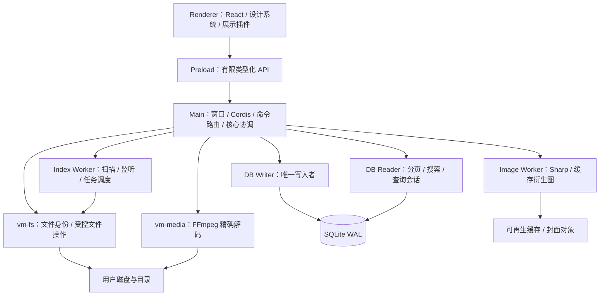
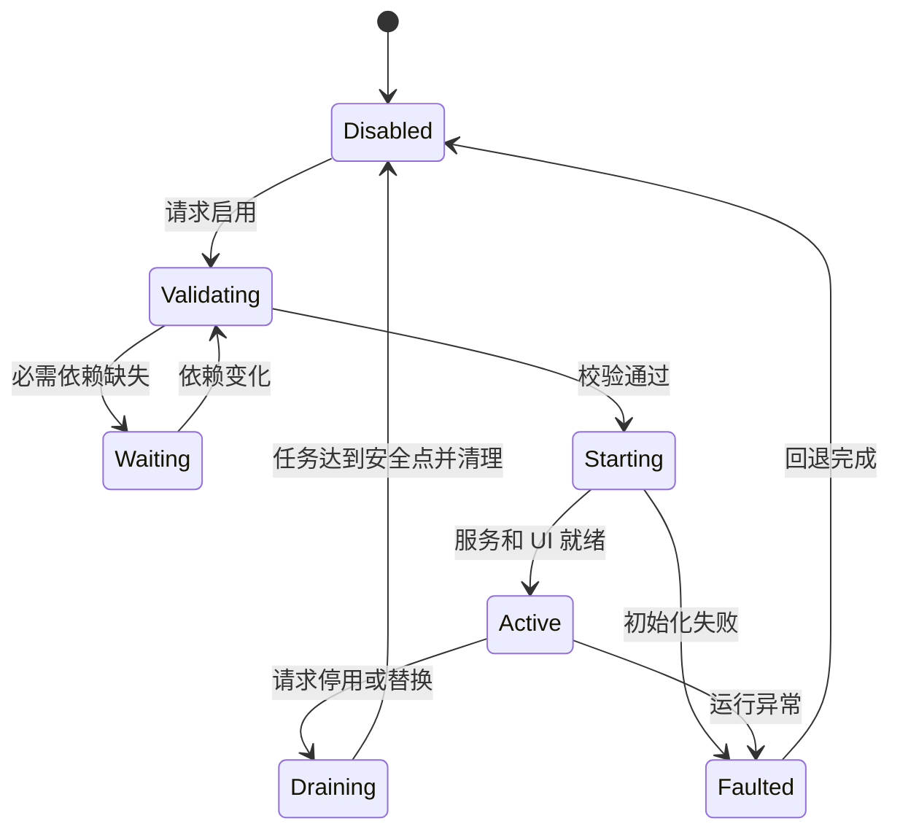
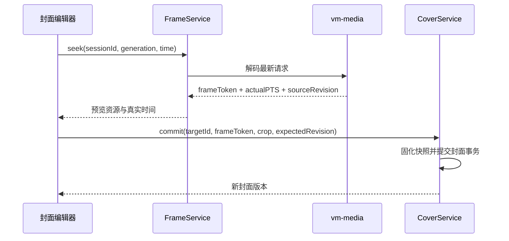
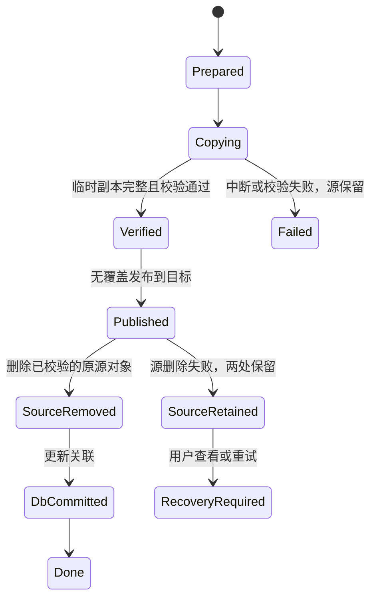

# VideoManager 技术需求与架构设计文档（TRD）

| 项目 | 内容 |
| --- | --- |
| 文档版本 | V1.0 · 技术评审稿 |
| 更新日期 | 2026-09-18 |
| 需求基线 | [PRD V1.0](F:/videoManager/docs/PRD.md) |
| 首发与规模 | Windows 11 x64；单库 1 万～10 万个媒体文件 |
| 架构结论 | Electron 多进程模块化应用；React 界面；Cordis 插件宿主；SQLite 本地数据；FFmpeg 独立解码服务 |
| 文档边界 | 明确技术选型、实现合同和发布门槛；不代表功能已实现或性能已测得 |

## 1. 目标、边界与技术决策

本设计将 PRD 转换为可开发、可验证的工程方案。三个同等重要的目标是：**界面具有完整的视觉品质，10 万文件下交互稳定流畅，媒体和用户管理数据始终按明确规则处理。**界面、可靠性与性能均有独立验收门槛，不能用“功能已接通”替代。

### 1.1 必须保持的产品合同

- 默认将直接子文件夹与直属媒体分区；可切换跨层总览，始终保留真实来源和返回位置。
- 路径展示、内容布局、查看器、封面策略等基于 Cordis 插件化；不同展示方案共享同一数据与导航状态。
- 自动封面仅做本地画面质量筛选；手动封面支持图片、视频精确选帧及裁剪，且永不被自动任务覆盖。
- 支持浏览、播放、搜索、标签、收藏、重命名、移动、系统回收站和管理数据迁移。
- 核心流程离线可用。除用户主动文件操作外，不修改源媒体；不要求将原文件复制入应用私有库。
- 首版为 Windows。复用领域模型、UI 与插件协议以支持后续 macOS；Android 另建客户端适配，不能直接交付 Electron 包。

### 1.2 关键架构决策

| 编号 | 决策 | 理由与代价 |
| --- | --- | --- |
| ADR-01 | Electron + React + TypeScript；模块化单体、进程隔离 | 保持用户指定框架，复用成熟桌面与前端能力；接受 Electron 基础内存成本，用任务调度和资源预算限制增长 |
| ADR-02 | 主进程仅协调；数据库、扫描、图像、精确解码在后台 | 大目录、同步 SQL 和原生解码不占用交互线程；增加 IPC 合同和故障恢复成本 |
| ADR-03 | Radix Primitives + 自建设计系统 + CSS Modules／设计令牌 | 可访问交互原语与视觉样式分离，形成统一媒体产品界面；需要专门建设组件和视觉回归 |
| ADR-04 | Cordis 管理功能生命周期，产品 SDK 稳定插件协议 | 降低插件与上游 API 的耦合；持久化、身份与文件事务属于不可随意卸载的核心 |
| ADR-05 | SQLite WAL + 单写入者 + 独立读取进程 | 本地数据可靠、可迁移；长查询与写入分开，不引入数据库服务器 |
| ADR-06 | Chromium 播放；FFmpeg 原生辅助进程负责精确帧解码 | 流畅播放与准确选帧分别发挥所长；需构建、测试并分发原生组件 |
| ADR-07 | 稳定条目 ID + 路径／文件身份映射 | 标签、收藏、封面不与可变文件名绑定；无法可靠识别的外部变化进入待确认流程 |
| ADR-08 | 文件系统操作日志 + 分阶段提交与恢复 | 文件系统和 SQLite 不存在共同事务；以可恢复流程处理崩溃和部分成功 |

## 2. 技术栈与依赖策略

### 2.1 选型清单

| 层次 | 选择 | 使用边界 |
| --- | --- | --- |
| 桌面运行时 | Electron 受维护的稳定发行版 | 窗口、系统选择器、IPC、自定义资源协议、回收站；不加载远程业务页面 |
| UI | React 19 + TypeScript strict | 客户端组件模型，不引入 SSR 或服务端组件 |
| 基础组件 | Radix Primitives、Lucide 图标 | 对话框、菜单、Popover、Tooltip、Slider 等；全部使用统一设计令牌包装 |
| 样式 | CSS Modules + CSS Custom Properties | 所有颜色、尺寸、排版和状态来自令牌；插件 CSS 必须有模块作用域 |
| 界面状态 | Zustand | 导航、选择、滚动锚点、查看器会话；不存整库媒体对象 |
| 异步查询 | TanStack Query v5 | 封装类型化 IPC，缓存分页结果与请求去重；数据权威来源仍为宿主 |
| 大列表 | TanStack Virtual | 目录树、媒体网格行、详细列表虚拟化；不一次挂载十万卡片 |
| 插件框架 | Cordis + 产品 Plugin SDK | 上游依赖集中在适配包，业务插件依赖产品接口 |
| 参数与配置校验 | Zod + Ajv | Zod 校验 IPC 数据；Ajv 校验插件清单的 JSON Schema 配置 |
| 数据库 | SQLite + better-sqlite3；参数化 SQL 与版本化迁移 | 同步数据库 API 仅在专用进程使用；开启 FTS5，不允许插件提交任意 SQL |
| 图像处理 | Sharp；BMP 等走 FFmpeg 解码适配 | JPEG／PNG／WebP／GIF 缩略图、裁剪、色彩转换；明确区分各解码器支持集合 |
| 视频与精确抽帧 | 自有 `vm-media` 辅助程序，C++17 + FFmpeg 库 | 固定版本的 libavformat、libavcodec、libavutil、libswscale 等；不依赖系统 PATH 中的 ffmpeg |
| 文件系统补充能力 | 自有 `vm-fs` 辅助程序，C++17 + Win32 | 文件身份、属性、无覆盖重命名、受控复制和源删除；后续实现 macOS 适配 |
| 工程构建 | pnpm workspace、electron-vite、electron-builder、CMake | JS 与原生组件独立构建，统一打包为离线安装包 |
| 质量工具 | Vitest、React Testing Library、Storybook、Playwright、原生单元测试 | 分别覆盖领域逻辑、组件、视觉、桌面端到端和解码／文件操作 |

选择依据：React 提供组件化基础，Radix 提供可定制的可访问交互原语，TanStack Virtual 负责虚拟化，Query 负责异步状态管理；它们不自动保证产品美观或性能，须遵守后文的实现预算。[React 版本说明](https://react.dev/versions)、[Radix 介绍](https://www.radix-ui.com/primitives/docs/overview/introduction)、[TanStack Virtual](https://tanstack.com/virtual/latest/docs/introduction)、[TanStack Query](https://tanstack.com/query/latest/docs/framework/react/overview)

### 2.2 版本与构建约束

在 M0 建立 `versions.json`，记录 Electron／内置 Node／Chromium、Cordis、React、SQLite、FFmpeg、原生编译器及目标架构的确切版本和构建摘要。依赖使用精确版本及锁文件，CI 执行冻结安装；TRD 不虚构尚未联合验证的补丁版本。

Cordis 上游仍提示 API 可能变化，因此只允许 `cordis-adapter` 导入上游生命周期接口。产品插件的 `hostApiVersion` 独立版本化，禁止通过升级 Cordis 隐式改变 SDK。[Cordis 上游仓库](https://github.com/cordiverse/cordis)

`better-sqlite3`、Sharp 的平台包及原生依赖必须在目标 Electron 中进行打包后验证；需要重建的模块针对 Electron ABI 构建，不能以开发机 Node 的加载成功代替验证。FFmpeg 辅助程序通过进程协议连接，不依赖 Node ABI。[Electron 原生模块说明](https://www.electronjs.org/docs/latest/tutorial/using-native-node-modules)

## 3. 总体架构与进程职责



| 进程／模块 | 可持有内容 | 明确禁止 |
| --- | --- | --- |
| Renderer | 当前窗口状态、有限页缓存、可见缩略图、一个活动播放器 | Node 集成、任意路径访问、数据库连接、大批量文件处理 |
| Preload | 编译后的单一 CJS 桥接模块、契约验证 | 暴露原始 ipcRenderer、fs、shell 或任意 channel 调用 |
| Main | Cordis 注册表、核心协调器、任务与锁元数据、资源授权映射 | 同步扫描、哈希计算、图片解码、长 SQL |
| DB Writer | 唯一读写连接、迁移、操作日志、事务 | 被业务插件绕过；长时间持有文件系统操作中的事务 |
| DB Reader | 只读主库连接、连接私有的查询会话临时表 | 写入媒体库主表；无限期持有 WAL 读取事务 |
| Index／Image Worker | 有界任务、扫描批次、图像处理会话 | 无上限任务队列与一次加载全部原图 |
| vm-media | 有界解码会话、关键帧索引、临近帧缓存 | 网络拉流、任意命令执行、未经批准的输出路径 |
| vm-fs | 受控文件句柄、身份与操作会话 | 使用 shell 拼接执行命令；越过任务约定的源／目标范围 |

Node 后台进程采用 Electron `utilityProcess`；原生程序通过绝对安装路径启动并隐藏控制台窗口。按需启动 Image／Media 服务，空闲回收；扫描、查询与文件操作不共享一个可被解码崩溃拖垮的进程。[Electron utilityProcess](https://www.electronjs.org/docs/latest/api/utility-process)

应用使用单实例锁，同一媒体库只允许一个写入协调器。切换媒体库前保存视图、关闭查询与读取租约、等待文件任务达到安全点，再切换库上下文。工作进程异常会使其请求明确失败；只自动重试幂等读取任务，文件变更进入恢复流程。

## 4. 视觉设计系统与界面工程

### 4.1 视觉方向

采用克制、清晰的媒体工作台风格：中性底色、大面积真实媒体、紧凑稳定的导航、柔和圆角与少量强调色。默认跟随系统明暗主题；布局尺寸和语义状态在两种主题中保持一致。所有内置插件使用同一设计系统，避免换布局后像进入另一款软件。

颜色不直接写入业务组件，以语义令牌引用：

| 令牌 | 深色 | 浅色 | 用途 |
| --- | --- | --- | --- |
| `canvas` | `#11151B` | `#F5F7FA` | 页面背景 |
| `surface` | `#191F28` | `#FFFFFF` | 卡片、工具栏、侧面板 |
| `surface-raised` | `#232C38` | `#EEF2F6` | 悬浮层和轻量状态背景 |
| `text-primary` | `#E8EDF4` | `#17212F` | 文件名、主要内容 |
| `text-secondary` | `#9BA8BA` | `#56657A` | 路径、计数、辅助说明 |
| `accent` | `#73D7BF` | `#126D5D` | 当前导航、主要按钮、焦点 |
| `on-accent` | `#0C1920` | `#FFFFFF` | 主按钮文字 |
| `border-subtle` | `#2B3543` | `#D9E0E8` | 分区与静态边界 |

令牌配对的 sRGB 对比度计算：深色主文字／页面为 15.56:1、辅助文字／面板为 6.86:1；浅色对应为 15.11:1、5.94:1；两种强调按钮文字分别为 10.38:1、6.23:1。上述结果仅覆盖列明的实色组合；半透明、媒体叠字、悬停和禁用态仍需逐项验证。媒体叠字使用稳定的深色底片，不能假设任意照片都满足对比度。

### 4.2 尺寸、字体与构图

| 元素 | 实现规格 |
| --- | --- |
| 字体 | Windows 使用 Segoe UI Variable／Segoe UI，中文回退 Microsoft YaHei UI；macOS 预留系统字体；不依赖在线字体 |
| 字号 | 主内容 14 px／20 px 行高；辅助 12 px／18 px；区块标题 16 px／24 px；页面标题 22 px／30 px；时长使用等宽数字 |
| 间距 | 4 px 基础单位，常用 8／12／16／24／32 px；界面内容左右留白 24 px |
| 圆角 | 控件 8 px、卡片 12 px、浮层 16 px；选中边框不改变盒模型尺寸 |
| 主框架 | 左栏默认 232 px，可在 200～300 px 调整；标题栏 40 px；路径栏 56 px；工具栏 44 px；状态栏 28 px |
| 网格 | 目标卡宽 224 px，可调 160～320 px；间距 16 px；目录封面 16:10；标题区固定高度，最多两行 |
| 详细列表 | 舒适行高 44 px、紧凑 36 px；列宽可调整，文件名列优先保留空间 |
| 详情面板 | 默认 360 px；空间不足时改为覆盖式侧面板，不将主体挤成单列 |
| 封面编辑器 | 独立对话框，宽度 `min(1120px, 100vw - 64px)`；主预览、时间轴、帧步进与裁剪预览形成明确层级 |

1280×720 为布局验收下限。Windows 高 DPI 以 CSS 像素布局，缩略图依据设备像素比请求；如果系统缩放后可用逻辑空间不足，折叠侧面板和次要工具，主操作必须仍可到达。

采用 Electron 标题栏覆盖能力保留系统窗口按钮、拖动和最大化体验；交互区域设置为不可拖动。系统半透明材质仅作为可关闭增强，基础主题用实色也须完整美观。[Electron 自定义标题栏](https://www.electronjs.org/docs/latest/tutorial/custom-title-bar)

### 4.3 核心组件合同

| 组件 | 功能与状态 | 工程要求 |
| --- | --- | --- |
| `PathNavigator` | 祖先导航、封面式同级切换、长路径折叠 | 当前目录与可点击祖先可区分；支持键盘展开与定位 |
| `FolderCard` | 封面、名称、直属计数、子目录数、离线标记 | 目录身份清晰；预览按钮在悬停或键盘聚焦时出现 |
| `MediaCard` | 缩略图、类型、时长、收藏、选择 | 图片完整显示可切换；视频不悬停自动播放；加载前预留尺寸 |
| `LibraryViewport` | 分区／跨层、网格／列表、框选与多选 | 插件接收统一 ViewModel；选择状态由核心 UI store 持有 |
| `QuickPreview` | 最多 12 项直属媒体与子目录入口 | 不改导航历史；Esc 返回原焦点；不抢占正在编辑的输入 |
| `MediaViewer` | 图片与视频共用队列、全屏与来源定位 | 队列由查询会话提供；仅有一个活动视频音频输出 |
| `CoverEditor` | 视频定位、真实帧步进、裁剪、目标确认 | 保存按钮只在最新帧准备好且目标有效时可用 |
| `TaskCenter` | 扫描、封面、文件操作进度与错误 | 按任务聚合信息；不为每个损坏文件弹出对话框 |
| `PluginSettings` | 功能分组、预览、依赖说明、配置验证 | 设置页面继承同一组件系统；冲突和故障状态可恢复 |

所有交互组件必须具备默认、悬停、按下、焦点、选中、禁用、加载、失败八类适用状态。菜单、Tooltip 和弹窗统一通过 OverlayManager 挂载，统一处理焦点、层级、Esc 和点击外部关闭。

### 4.4 动效、可访问性与视觉验收

- 普通反馈 120～160 ms，侧面板与对话框 180～200 ms；只动画 `opacity` 与 `transform`。媒体网格不做全量位置动画、悬停放大或逐卡入场。
- 缩略图加载后原位淡入，不改变布局；加载低于 150 ms 不闪现骨架，耗时较长才展示稳定占位。
- 键盘焦点至少 2 px 可见轮廓；焦点、选中和收藏不得仅靠颜色。虚拟化后聚焦项目必须先滚入并挂载，不能把焦点留在已卸载节点。
- 编辑视频时间点可键盘输入；左右帧步进具有可读名称；屏幕阅读器能获知当前选中数量、加载与错误状态。
- 支持 `prefers-reduced-motion`；Windows 高对比度模式下保留边界和焦点。普通文字达到 4.5:1，对必要控件轮廓及状态标识以 3:1 为目标验证。
- Storybook 固定媒体样本、字体与时间，建立明暗主题、空态、离线、长标题、混合内容、选帧等待及失败状态基线；不以默认组件库页面截图替代产品设计。

视觉发布阻断项包括文字裁切、遮挡、无焦点、误导性点击区域、缩放错位、同类组件风格不一致，以及在完整显示模式下意外裁掉图片主体。

## 5. 状态模型、虚拟化与浏览连续性

### 5.1 状态所有权

| 状态 | 唯一权威所有者 | 持久化方式 |
| --- | --- | --- |
| 媒体、目录、标签、收藏、封面 | 数据库核心服务 | SQLite 与封面对象库 |
| 查询条件与导航历史 | `NavigationStore` | 当前会话即时更新；按目录保存最后使用配置 |
| 已加载的结果页 | TanStack Query | 有上限内存缓存，失效后可重建 |
| 选择与滚动锚点 | `SelectionStore`／`ViewportStore` | 以条目 ID 和查询会话为依据，插件切换期间保留 |
| 播放／选帧会话 | Viewer／Decode Session | 播放进度节流保存；解码帧为短期资源 |
| 插件活动状态与配置 | PluginManager | 已确认配置持久化，预览状态不覆盖正式配置 |

```ts
type BrowseScope = 'direct' | 'descendants' | 'library';
interface BrowseState {
  libraryId: string;
  rootId?: string;
  folderId?: string;
  scope: BrowseScope;
  query: QuerySpec;
  querySessionId?: string;
  navigationPluginId: string;
  layoutPluginId: string;
  anchor?: { entryId: string; offsetWithinRow: number };
  focusedEntryId?: string;
}
type Selection =
  | { kind: 'explicit'; ids: string[] }
  | { kind: 'snapshot'; snapshotId: string; excludedIds: string[]; count: number };
```

上述为产品契约示意，具体类型从 `contracts` 包共享；不把 React store 或 Cordis Context 对象传入其他进程。

### 5.2 大列表实现

网格按固定高度的“行”虚拟化，行内使用 CSS Grid；详细列表和目录树按项目虚拟化。一个主滚动容器包含目录分区、分区标题和媒体分区，避免嵌套滚动造成键盘与位置恢复异常。

初始页 100 项、后续页 200 项；DOM 仅保留可见范围及前后 2 屏，总卡片实例上限初始设为 300。`ResizeObserver` 改变列数时，先记录锚点条目，再重算其所在行；卡片 key 使用稳定 entryId。

缩略图请求取消离屏低优先级任务；页面缓存最多 10 页，查询会话保留有序 ID。邻近查看媒体只预取前后各一项，不解码整个相册。Zustand 使用精细 selector，单项收藏改变不得重新渲染整片网格。

### 5.3 查询会话与选择一致性

查询读取进程为一次浏览生成 `querySessionId`，将有序 `entryId + entryVersion + ordinal` 写入连接私有临时表；仅物化 ID 和版本，不将十万完整对象传给界面。短读事务完成后释放，分页按 ordinal 范围读取并关联当前摘要，避免大 OFFSET 扫描和长事务钉住 WAL。

会话最多保留 3 个活动视图，未使用 10 分钟回收，活动视图续期。数据库变更通过失效事件通知：初次扫描每 500 ms 合并刷新；用户多选、拖动或编辑时冻结结果位置并显示新增计数，结束后按锚点刷新。失效条目在刷新前以不可操作状态保留，禁止换成同名新文件。

Ctrl+A 在扫描范围和所需筛选元数据完整时才可用。宿主将当前会话 ID 与版本清单固化为持久化 selection snapshot，返回句柄与准确数量；批量操作只使用该清单并逐项重新校验。查询会话过期则提示重新确认选择，不悄悄按最新条件重选。

### 5.4 导航与布局切换

进入文件夹记录完整 BrowseState；快速预览不写导航历史。“定位所在目录”保存旧状态后打开真实父目录、切到 direct 范围并临时清除阻碍定位的条件；后退恢复旧查询和锚点。

展示插件只消费 `BrowseViewModel` 并触发类型化意图。切换布局时先准备新插件和必要数据，再交换呈现器；失败回退旧插件。所选条目、查询语义与路径归属不由布局插件重定义。

## 6. Cordis 插件体系

### 6.1 功能槽位与模块边界

| 扩展点 | P0 内置模块 | 同时活动规则 |
| --- | --- | --- |
| `navigation.presenter` | 目录树导航、可视化路径导航 | 同一区域仅一个；基础面包屑恢复入口由应用壳保留 |
| `content.layout` | 卡片网格、详细列表 | 一次一个；从同一查询会话读取相同条目 |
| `viewer.image`／`viewer.video` | 图片查看器、Chromium 视频查看器 | 按能力和用户默认配置选择；一个活动播放会话 |
| `media.probe`／`thumbnail.provider` | 图片元数据、FFmpeg 探测、图像／视频缩略图 | 按媒体能力路由，不盲目按扩展名调用 |
| `cover.strategy` | 非 AI 画面质量优选 | 每次生成任务固定策略版本；已有手动封面不参与覆盖 |
| `cover.editor` | 图片选择、视频选帧、裁剪编辑器 | 通过核心 CoverService 保存，不直接写封面记录 |
| `search.provider`／`organize.actions` | 本地查询、标签、收藏 | 入口可配置；数据在停用后保留 |
| `file.actions` | 重命名、移动、回收站入口 | 提交核心 OperationService；UI 卸载不丢失已提交操作 |
| `source.provider`／`index.provider` | 本地资源与索引 | 媒体库使用期间为必需依赖；停用资源用专门断开流程 |

缩略图、数据库代理与文件事务通过核心 service contract 协作。禁止插件相互导入内部实现、直接更新数据库或自行重新定义 entryId。

### 6.2 清单与 SDK

```json
{
  "id": "builtin.content-grid",
  "version": "1.0.0",
  "hostApiVersion": "^1.0.0",
  "platforms": ["win32", "darwin"],
  "requires": ["library.query", "selection", "thumbnail.read"],
  "contributes": [{ "slot": "content.layout", "id": "grid" }],
  "hostEntry": "host.mjs",
  "uiEntry": "ui.mjs",
  "styles": ["ui.css"],
  "configSchema": {
    "type": "object",
    "properties": { "cardWidth": { "type": "integer", "minimum": 160, "maximum": 320 } },
    "additionalProperties": false
  }
}
```

此清单为产品 SDK v1 的设计示例，不是 Cordis 原生清单格式。插件的 `platforms` 声明必须与实测能力一致；它不能据此让整个 macOS 客户端提前成为受支持产品。

SDK 提供只读查询、导航意图、选择命令、任务提交、封面服务、配置存取和生命周期资源登记。事件、定时器、监听和挂载均登记 disposer；上游 Cordis 接口只由适配器使用，其服务依赖由产品清单映射后交给 Cordis 编排。

UI 插件预编译为 ESM，通过受控本地资源协议加载；React／ReactDOM／UI SDK 由宿主提供单例并通过固定 import map 解析。其余依赖打入插件包，禁止附带另一份 React。样式为 CSS Modules 或插件前缀作用域，禁止重写应用全局主题、滚动条或通用标签样式。

普通模式仅加载随安装包交付的清单；开发模式加载用户选定的本地目录，检查入口仍位于该目录内、版本兼容及依赖可用。开发模式本地代码按可信代码处理，不宣称 Cordis 作用域、UI 槽位或清单权限构成恶意代码沙箱。

### 6.3 生命周期与切换事务



展示切换按“保存状态 → 校验和预加载 → 隐藏区域准备 → 原子交换槽位 → 卸载旧实例 → 持久化配置”执行。候选准备超时 3 秒则中止，旧视图继续可用；新实例激活失败清理其全部注册，不提交配置。

必需服务停用前展示依赖影响；可取消任务先取消，已提交文件操作由核心继续执行到安全点。对插件配置使用 revision 比较，失败保留上一可用配置。不得为了实现热更新，在文件操作中途卸载执行服务。

React ErrorBoundary 负责渲染异常，异步处理器统一捕获并报告；它们无法隔离无限循环或原生崩溃。保存启动中的插件组合与上次成功组合，连续两次未完成启动时进入恢复模式，仅加载内置基础导航和列表；损坏数据迁移不得借插件重试继续执行。

## 7. 进程通信与本地资源协议

### 7.1 类型化 IPC

界面只通过 `window.vm` 的显式方法调用能力，禁止任意 channel、任意命令和绝对路径参数直通。所有请求在宿主再次校验，界面校验仅用于即时反馈。

```ts
interface RequestEnvelope<T> {
  protocolVersion: 1;
  requestId: string;
  libraryId: string;
  payload: T;
}
type Result<T> =
  | { ok: true; requestId: string; data: T }
  | { ok: false; requestId: string;
      error: { code: string; message: string; retryable: boolean; detailsId?: string } };
```

| 方法组 | 核心接口 | 关键输入／返回 |
| --- | --- | --- |
| 资源 | `roots.pick`、`roots.add`、`roots.rebind` | 系统选择器返回 rootCandidateId，宿主解析路径并生成预览 |
| 查询 | `library.openQuery`、`library.page`、`library.locate` | QuerySpec → querySessionId／count／complete；页大小上限 200 |
| 选择 | `selection.freeze` | 当前会话与排除项 → snapshotId／count／scopeRevision |
| 媒体 | `media.open`、`media.release` | entryId → 绑定会话的资源 URL 与能力集 |
| 选帧 | `frames.open`、`frames.seek`、`frames.step`、`frames.close` | sourceHandle／decodeSessionId／requestGeneration → frameToken／真实时间戳 |
| 封面 | `covers.recommend`、`covers.commit`、`covers.restoreAuto` | targetId／frameToken 或 imageToken／crop／expectedCoverRevision |
| 组织 | `tags.apply`、`favorites.set` | 明确 ID 或 snapshotId；命令幂等键 |
| 文件 | `operations.plan`、`operations.commit`、`operations.cancel` | 选择快照与目标 → planId／影响摘要 → operationId |
| 插件 | `plugins.preview`、`plugins.apply`、`plugins.disable` | pluginId／配置／expectedRevision；返回影响与状态 |
| 迁移 | `library.export`、`library.import` | 选择器授权句柄 → 后台任务与校验报告 |

宿主从 Electron 事件获得发送窗口与 frame，核对固定应用 origin、主 frame、库上下文和已登记能力，不信任 payload 中自报的身份。请求大小默认上限 1 MiB，大批量 ID 使用 snapshotId，图片和视频不以 base64 放入 IPC。

普通查询软超时 2 秒；较长任务立即返回 taskId，通过 `task.progress` 更新。取消请求绑定原请求和调用者；UI AbortSignal 不能跨进程直接传递，须映射为显式 cancel 消息。超时的写操作先查 operationId，不自动重复执行。

better-sqlite3 的同步执行不能仅靠同进程消息立即中断。读取进程超过 3 秒仍无响应时，可由宿主终止并重建该只读进程，原查询会话返回 QUERY_EXPIRED，由 UI 按查询和锚点恢复；这条策略不得用于写入进程或已提交文件任务。

事件包含 `libraryId、processGeneration、sequence、topic、entityIds、revision`；界面发现序号缺口后刷新相关缓存。进度每秒最多推送 10 次，终态立即推送；库变更和缩略图完成按 50～100 ms 合批。

统一错误码至少包含 `ROOT_OFFLINE、ACCESS_DENIED、SOURCE_CHANGED、NAME_CONFLICT、UNSUPPORTED_CODEC、FRAME_NOT_READY、QUERY_EXPIRED、PLUGIN_DEPENDENCY_MISSING、OUT_OF_SPACE、CANCELLED、RECOVERY_REQUIRED`。用户提示提供下一步动作，技术堆栈仅进入本地诊断。

### 7.2 原生进程协议

`vm-media` 与 `vm-fs` 使用版本化、长度受限的 NDJSON 控制协议，消息带 requestId；JSON 中换行必须转义，单条控制消息不超过 1 MiB。标准输出仅用于协议，诊断走标准错误。进程通过 `shell: false` 的参数数组启动，父进程退出时清理其任务；Windows 使用 Job Object 管理派生进程生命周期。

大图输出到宿主创建的会话临时目录，返回 opaque token；不接受插件提供的任意输出路径。目标文件写完并校验后才能发布 token。原生程序校验协议版本、整数边界、路径范围和媒体输出尺寸；解析失败仅终止对应会话。

### 7.3 图片和视频访问

应用静态资源使用 `app://shell/`；媒体使用独立 `media://resource/<token>`，token 映射至库、条目版本、用途和读取租约，URL 不暴露原始路径。窗口使用独立 session，协议处理器闭包绑定该窗口和会话；关闭窗口或资源会话后撤销 token。

`app` 与 `media` 在 ready 前完成所需 scheme 注册，在实际窗口 session 上注册 handler；只启用所需的标准 URL、fetch 和流能力，不使用 `bypassCSP`。Electron 的协议与 session 绑定规则必须在打包后验证。[Electron protocol](https://www.electronjs.org/docs/latest/api/protocol)

媒体 handler 必须实现：

- `GET／HEAD`、正确 MIME、Content-Length 和 `X-Content-Type-Options: nosniff`；媒体不得以 HTML 或脚本返回。
- 视频单段 byte Range：普通范围、开放终点和后缀范围返回 206；不可满足范围返回 416；完整读取返回 200。多范围请求不支持时明确拒绝，不拼接错误响应。
- 正确的 Content-Range／Accept-Ranges、背压和请求取消；用流传输，不一次 `readFile` 大视频。CORS 只允许固定应用 origin，媒体接口不接受网络 URL。
- 请求前解析 token 并取得受校验的文件句柄；不根据 URL 文本拼接磁盘路径。文件变更时失效 token、关闭读取租约并更新界面。

## 8. 数据存储与查询设计

### 8.1 数据布局与一致性

```text
userData/
  settings.json                 # 设备级主题、窗口与上次打开的库
  libraries/<libraryId>/
    library.sqlite              # 事务数据、索引、日志
    objects/manual-covers/      # 不可被缓存清理的手动封面
    cache/                      # 缩略图、自动封面、临时预览
    temp/                       # 导入、选帧、未提交对象
    backups/                    # 升级前数据备份
    logs/                       # 本地诊断，不默认上传
```

数据库位于本机应用数据目录，源媒体可在外接盘；不把活动 WAL 数据库放在网络共享盘。SQLite WAL 支持本机读写并行，但仍只有一个写入者且依赖共享内存机制。[SQLite WAL](https://www.sqlite.org/wal.html)

写连接开启 `foreign_keys=ON、journal_mode=WAL、synchronous=FULL`，设置有界 busy timeout；事务只包含短批量数据库变更。优先处理用户写入和文件操作日志，扫描按最多 500 条或约 20 ms 的批次提交。空闲时 checkpoint，记录 WAL 大小；不允许查询会话持续占有主库快照。

### 8.2 核心表

| 表 | 核心字段／约束 | 作用 |
| --- | --- | --- |
| `libraries` | id、schema_version、index_revision | 库与结构版本 |
| `roots` | id、mount_path、canonical_identity、state、generation | 资源根目录与当前挂载；归档根保留关联 |
| `entries` | rowid、id UNIQUE、root_id、parent_id、kind、name、path_key、rel_path、state、fs_revision、metadata_revision | 目录／图片／视频条目；活动路径唯一，缺失／已回收记录可保留 |
| `file_identities` | entry_id、volume_id、file_id、birth_marker、size、mtime、fingerprint_type／value | 身份证据；file_id 不设唯一约束，硬链接可能共享身份 |
| `media_metadata` | entry_id PK、mime、codec、duration_us、width、height、rotation、probe_state | 可渐进补齐的媒体属性；未知值为 NULL |
| `folder_closure` | ancestor_id、descendant_id、depth；复合主键 | 仅目录祖先关系，含 depth=0 自身；跨层查询不依赖模糊路径前缀 |
| `folder_stats` | folder_id、direct_images／videos／folders／other、subtree_count、complete_generation | 区分直属与后代计数，保存统计完整性 |
| `tags`／`entry_tags` | 标签规范化名称唯一；entry_id + tag_id 唯一 | 标签与多对多关联；不隐式继承目录标签 |
| `favorites`／`playback_state` | entry_id 主键、position_us、source_revision | 收藏与续播；播放位置不得套到已替换文件 |
| `covers` | target_id PK、mode、object_hash、source_entry_id、source_revision、pts、timebase、crop_json、revision | 当前生效封面，手动模式具有写入优先权 |
| `objects`／`cache_entries` | hash、class、relative_storage_path、size、references／lease、last_access | 用户对象与可再生缓存分离 |
| `scan_runs`／`scan_directories` | run_id、folder_id、状态、错误、完成代数 | 仅对完整读取的目录执行缺失判定 |
| `jobs` | id、kind、dedupe_key、priority、state、owner、lease、attempts | 可取消后台任务及过期领取恢复 |
| `operations`／`operation_items` | request_key UNIQUE、plan_hash、状态、源／目标证据、已持久化阶段 | 文件事务日志与幂等恢复 |
| `selection_snapshots`／`selection_items` | snapshot_id、entry_id、expected_fs_revision、ordinal | 全选、批量组织与文件操作的固定对象集 |
| `plugin_configs`／`view_states` | plugin_id、schema_version、revision；目录与模式键 | 插件配置和浏览状态；与插件安装文件分离 |

所有实体 ID 在库内使用 UUID；SQLite 整数 rowid 用于索引和关联优化，不作为迁移或插件公开身份。文件时间和视频时间以整数存储；超过 JS 安全整数范围的值跨 IPC 使用十进制字符串，禁止精度截断。

### 8.3 索引与搜索

必需索引包括 `entries(parent_id, kind, state, natural_sort_key, id)`、`entries(root_id, state)`、活动条目的唯一 `root_id + path_key`、`folder_closure(ancestor_id, descendant_id)`、`entry_tags(tag_id, entry_id)` 及常用媒体筛选索引。自然排序键使用版本化、确定性的数字段比较与文本编码生成；不依赖不同系统下排序结果可能不同的临时 locale。

跨层媒体通过目录 closure 连接其 parent_id 得到；当前目录按 parent_id 直接查询。SQL 编译器只接受类型化 QuerySpec，搜索范围与目录归属先约束，再应用筛选与排序；所有参数绑定，排序字段使用白名单。

名称和相对路径建立 FTS5 trigram 索引。长度至少 3 个 Unicode 字符的搜索词先利用 trigram 得到候选，再用规范化字符串包含匹配校验；1～2 字词在已限定范围内用 `instr` 回退查询。多个词分别满足“名称或路径包含该词”，词之间 AND，通配字符按字面量处理。短中文词不能直接依赖 trigram MATCH，否则可能无结果。[SQLite FTS5 trigram](https://www.sqlite.org/fts5.html)

FTS 与条目更新在同一写事务中维护，并提供完整性校验与重建。文件夹重命名需更新全部后代的相对路径、路径搜索字段和受影响计数；迁移版本变化后重建派生索引，不复制旧平台排序假设。

### 8.4 路径与文件身份

显示名称保留原字符，查询规范化字段与真实路径分开。数据库相对路径采用统一 `/` 表示，实际系统调用通过平台 PathAdapter 转换；拒绝 `..`、绝对路径注入、非法设备名和越界根目录。

Windows 使用原生句柄取得卷标识、文件 ID、属性和最终路径；支持长路径 Unicode API，按实际目录的大小写语义生成 path_key，不对所有路径无条件 lower-case。遇到重解析点默认不递归跟随。[Windows 文件信息 API](https://learn.microsoft.com/en-us/windows/win32/api/fileapi/nf-fileapi-getfileinformationbyhandleex)

文件 ID 只是身份线索：应用内操作由日志保留 entryId；外部变化只有在旧位置缺失、新位置身份唯一且元信息一致时自动关联。硬链接的两个目录项保持两个 entryId；普通复制得到新 entryId。证据不足或存在歧义时保留旧管理信息并创建待确认项，不自动合并。

## 9. 扫描、监听与任务调度

### 9.1 渐进式扫描

按“当前目录 → 可见子目录 → 其他后代”的队列发现条目。Index Worker 分批调用平台枚举接口，先记录类型、名称、大小和修改时间；解码元数据、缩略图及封面独立排队，不在枚举循环内等待。

每个目录维护扫描代数：标记 running，读取批次，记录 observed 条目，仅在该目录成功读到末尾后标记 complete。未观察到的旧条目只有在对应目录完整且在线时才成为 missing；部分失败、取消、离线和权限错误不触发删除判定。重扫复用已完成且未变化的文件版本。

根目录添加使用平台规范路径与身份判断重叠。合并已有根目录时先生成映射预览，在单次受控变更中保留 entryId 并调整 root_id／rel_path；同时停止相关扫描、使查询失效，恢复后重新校验。

隐藏与系统属性由平台枚举提供；默认排除系统目录、回收站、应用自有缓存和重解析点。非媒体文件仅计数，不为所有无关文件建立媒体条目；整目录文件操作仍需重新枚举完整内容。

### 9.2 文件变化监听

Windows 平台监听封装在 SourceProvider，输出统一变更事件；监听事件仅用于标记脏目录。对同一路径 300 ms 合并抖动，先复核真实状态再写索引，不依据单个 rename 事件直接删除或绑定媒体。

OperationService 向索引器登记正在变更的源／目标范围，相关监听事件暂存合并，临时复制文件排除纳管。先由操作事务完成身份和路径更新，再重放范围复核；已发布但尚未完成的目标关联 operationId，不能被普通扫描重复创建或提前自动关联。

发现事件溢出、监听失败、磁盘重连、应用恢复前台时，补充复核相关目录；根目录每 15 分钟进行低优先级可中断一致性检查。离线状态通过访问结果与错误类别判断，盘符复用时验证卷身份，不自动把原库映射到另一块盘。

### 9.3 调度预算

| 优先级 | 工作 | 初始资源策略 |
| --- | --- | --- |
| 最高 | 文件操作安全提交、用户精确选帧 | 文件提交不被杀死；选帧优先占用一个解码槽 |
| 高 | 当前目录、可见缩略图、打开媒体 | 尽快返回首屏，过期导航任务取消 |
| 中 | 相邻预取、当前目录候选封面 | 不挤占用户播放和选帧 |
| 低 | 深层扫描、离屏缩略图、统计与复核 | 可暂停，等待用户任务空闲 |

视频解码总槽初始上限 2；用户选帧需要时暂停或取消可重试后台任务。Sharp 图像并发初始为 2，磁盘枚举最多 2 个目录并发，同一物理磁盘同时最多 1 个大型复制／校验任务；参数经 M0 基准校正，不能直接设为 CPU 核数无限扩展。

每个任务具有 `sourceRevision + taskKind + strategyVersion` 去重键。可见需求与后台需求合并引用计数，全部消费者取消后才终止可取消任务。原生解码超时先协作取消，超过 2 秒仍未退出则终止该解码进程；文件提交进程不可复用这类强杀策略。

## 10. 图片查看、视频播放与精确选帧

### 10.1 能力模型与播放

每个条目分别提供 `canDisplay、canPlay、canProbe、canThumbnail、canSeekFrame` 及原因。先探测容器／编码，再通过发行版实际能力决定入口；扩展名、浏览器 canPlayType 或 FFmpeg 支持列表均不能单独替代实际解码测试。

图片默认展示适配屏幕的衍生图，缩放至原始比例时按需请求高分辨率。应用 EXIF 方向和一致的色彩转换；动态 GIF 在查看器播放，卡片为静态图。Sharp 无法处理的 P0 图片类型通过媒体解码适配器转换，BMP 必须有独立样本，不能误认为 Sharp 能覆盖全部格式。

视频使用 HTMLVideoElement，经受控 Range 流读取；新进入的视频暂停，用户操作后播放。续播位置每 5 秒及暂停／退出时保存，记录对应 sourceRevision；文件替换后不沿用旧进度。释放时执行暂停、清空来源和 load，撤销 token、读取租约及事件监听。

`requestVideoFrameCallback` 可用于获得当前呈现画面的 mediaTime、减少播放进度与画面偏差；它不是完整视频帧索引，也不能替代向前／向后逐帧解码。[MDN 视频帧回调](https://developer.mozilla.org/en-US/docs/Web/API/HTMLVideoElement/requestVideoFrameCallback)

JPEG、PNG、WebP、GIF、BMP，以及 PRD 指定的 MP4／WebM 编码组合必须在最终安装包中验证播放／显示和所需封面能力；MOV、MKV、AVI 等分别探测，不支持时提供系统默认应用打开与自定义图片封面。

### 10.2 精确选帧解码服务

`vm-media` 是独立 C++17 程序，直接使用 FFmpeg 解复用和解码 API。首版交互选帧以软件解码作为可重复的基准；日常视频播放可使用 Chromium 硬件加速。为逐帧操作维持短时会话，避免每点一次按钮都启动新的 ffmpeg 命令。

解码流程：

1. 宿主根据选中的媒体或系统选择器授权生成 sourceHandle；锁定 sourceRevision，探测视频流、时基、起始时间、旋转和像素比例。
2. 将用户时间映射到流时间轴，向前一个可用关键帧定位，清理解码器缓冲，顺序解码到目标显示区间。使用实际 PTS／best-effort timestamp 和时基，不能按平均 FPS 推算。
3. 粗定位选择显示区间包含目标时间的帧；边界或损坏时间戳无法可靠判断时报告状态并保留最后有效帧，不返回随机画面。B 帧按呈现顺序处理，VFR 使用各帧真实时间。
4. 前一帧／后一帧在解码会话的有序帧窗口移动；越出前向窗口则继续解码，越出后向窗口则回退更早关键帧并重建窗口，不使用 `currentTime ± 1/fps`。
5. 为选定帧应用固定的方向、像素比例和色彩处理，生成显示预览与可保存的原始快照，返回 frameToken、实际时间戳、尺寸和来源版本。

FFmpeg 的定位接口以流时基表达时间，定位到关键帧后仍需继续解码；仅一次 seek 不等于拿到目标显示帧。[FFmpeg 解复用与定位 API](https://ffmpeg.org/doxygen/trunk/group__lavf__decoding.html)

帧窗口只保存最多 12 张低分辨率预览，总预览缓冲初始上限 96 MiB；全分辨率帧仅保留当前选中项，其他帧保存定位信息。检查像素数、内存预算和解码耗时，超限返回明确错误。HDR 等色彩能力单独标记，预览与导出须共用同一转换链，不能预览一种色调而保存另一种。

### 10.3 请求顺序与画面一致性



拖动时间轴最多每 80 ms 提交一次预览请求，释放鼠标立即提交最终值；较旧 generation 的响应全部丢弃。保存时必须持有最新成功帧的 frameToken，不能保存请求中的未完成帧。

frameToken 绑定 `decodeSessionId、sourceRevision、streamIndex、真实 PTS、会话内呈现序号、对象摘要`；相同 PTS 的帧仍能通过呈现序号区分。跨 IPC 的原始 PTS 以十进制字符串和有理时基传递。

保存使用该 token 指向的同一帧对象，不再次根据浮点时间 seek 截图。解码进程崩溃、来源变化或 token 过期时，保存按钮失效，保留已展示预览与恢复入口；不能假装保存成功。

## 11. 封面、缩略图与对象生命周期

### 11.1 自动候选算法

严格执行 PRD 的预算：每个目录最多 24 张图片、4 个视频，每视频最多 8 帧，最多展示 6 个候选；当前目录缺乏可用媒体时按已索引后代深度补充。候选按稳定排序分散选取，不只取文件名前几个。

视频取样分布在约 10%～90% 的有效时长；极短视频使用可获得的不同帧。将候选缩小到统一评估尺寸，计算边缘清晰度、曝光／黑白饱和比例、画面信息量和裁剪保留面积。初始排序权重为 0.50／0.25／0.15／0.10，使用感知哈希排除高度相似候选；阈值与算法版本记录在策略配置中，通过样本评审调整。

自动任务为每个目录设置 10 秒前台处理预算，超时返回已有结果，其余低优先级继续或等待重试；不得把一条高成本视频拖成整库阻塞。用户手动操作、目标封面版本改变或策略停用后，任务提交必须重新检查有效性。

### 11.2 防止手动封面被覆盖

自动任务开始时记录 `targetId、coverRevision、strategyVersion、sourceRevision`，结果保存采用条件更新：只有目标仍为自动模式、封面 revision 未变且来源仍有效时，才可替换。影响行数为 0 视为结果过期，丢弃衍生结果，不重试覆盖。

手动保存顺序为：

1. 校验目标存在、期望 coverRevision 一致、frameToken／imageToken 有效。
2. 将选定画面写为独立无损快照，裁剪参数以相对坐标保存；快照使用显示方向，不能混用旋转前坐标。
3. 在用户对象目录内完成临时写入、flush、摘要校验和原子发布；先确保对象可读，再开始数据库事务。
4. 事务内写入 `mode=manual`、对象引用、来源、PTS／时基、裁剪和新 revision，同时释放旧对象引用；提交后广播封面变更。
5. 失败保留旧封面；中途发布但未引用的对象成为可回收孤儿，不能错误替换当前封面。

视频快照保存的是所选帧，图片封面保存的是所选图的独立显示快照；原文件移动或删除不会删除快照。“恢复自动”先准备可用结果，再经显式用户动作和条件事务切换模式；自动结果失败则保持手动状态。

### 11.3 缓存层级

| 层级 | 内容 | 约束 |
| --- | --- | --- |
| 手动对象库 | 原始快照、必要编辑信息 | 用户数据；只能在引用释放和保留策略确认后回收，绝不计入普通缓存淘汰 |
| 磁盘可再生缓存 | 256／512／1024 px 等级的 WebP 缩略图、自动候选、预览 | 默认 5 GB；按可见性、读取租约、最近使用时间淘汰 |
| Renderer 内存 | 可见缩略图和相邻项 | 目标不超过 128 MiB 解码图像；离屏释放对象 URL 和 ImageBitmap |
| 编辑临时对象 | 当前帧和未提交裁剪预览 | 会话持有租约；关闭后延迟清理，运行中不得被缓存清理删除 |

缩略图键包括 `entryId + sourceRevision + decoderVersion + dimensions + orientation + cropHash`；写入后原子发布，避免半张图片被读取。目录封面衍生图同时包含 coverRevision。

后台垃圾回收先检查数据库引用、活动编辑／导出租约和最少 24 小时孤儿宽限期。显式“清理缓存”只清理 cache 类对象；旧手动封面如已被替换，按用户数据清理规则处理，不借缓存按钮顺带删除。

## 12. 文件操作与崩溃恢复

### 12.1 不变量

1. 不覆盖未获明确处理的同名目标；首版仅提供保留两者、跳过、取消。
2. 跨盘复制未完整校验前，不删除源文件；批量取消不撤销已经成功的项目。
3. 对象关联以 entryId 保留，路径变化只有在真实文件系统结果核实后提交。
4. 用户对文件夹操作时包含非媒体与隐藏内容；不得直接用媒体索引充当完整文件清单。
5. 回收站失败绝不调用永久删除作为后备路径；任何结果不确定的删除类操作不得自动重试。

### 12.2 操作计划与并发控制

`operations.plan` 根据选择快照生成不可变计划，折叠父目录与后代重复选择，枚举真实影响范围，并记录源文件身份、目标规范路径、冲突、空间预估与 planHash。计划初始有效期 5 分钟；确认或提交前再次检查，影响范围变化时返回新摘要而非继续使用过期确认。

宿主采用目录／条目级操作锁，按稳定 ID 顺序取锁，禁止移入自身和后代；关闭受影响播放、预览与解码读取租约。应用内锁协调本应用任务，不能假设它阻止外部软件修改文件，因此原生执行阶段还须验证身份并在必要时持有限制写入／删除共享的文件句柄。

每次提交使用 requestKey 去重；同一 requestKey 重复请求返回原 operationId。日志写入成功后才执行副作用。UI 显示逐项结果，取消只影响尚未提交或可安全终止的阶段。

### 12.3 同卷重命名／移动

采用平台无覆盖重命名原语，不使用“先检查不存在，再调用可覆盖 rename”作为安全保证。Windows 适配使用不带替换标志的原生操作；纯大小写重命名通过唯一临时名称分两步，并记录中间状态。跨卷不依赖一次 MoveFileEx 的成功值判断完整搬迁，因为其复制允许模式可能在源删除失败时仍报告成功。[Windows MoveFileExW](https://learn.microsoft.com/en-us/windows/win32/api/winbase/nf-winbase-movefileexw)

日志阶段为 `PLANNED → PREPARED → FS_APPLIED → DB_COMMITTED → DONE`。文件系统变化后以文件身份确认目标，再在数据库事务中更新 root_id、parent_id、后代相对路径、closure、FTS 和计数。目录变更期间相关读取显示“正在更新位置”，不能继续使用旧路径读取另一个同名文件。

若崩溃发生在文件系统成功而数据库提交前，启动恢复根据日志和目标身份补交数据库。源／目标证据矛盾则进入 RECOVERY_REQUIRED，保留两侧文件，不能盲目回滚或覆盖。

### 12.4 跨卷移动



| 阶段 | 实现要求 |
| --- | --- |
| 预检 | 完整树清单、目标文件系统能力、路径长度、单文件大小限制、可用空间；默认不跨盘复制重解析点，遇到无法保真的项先报告，不跟随其目标 |
| 复制 | 在目标卷建立 operationId 专属临时文件，独占创建；按流复制，保持源身份，源存在并发写入风险时拒绝操作 |
| 校验 | flush 目标后独立读取目标，比较字节数和 SHA-256；源复制期间保持稳定，重新核实其身份；不能只比较大小与时间 |
| 内容保真 | 检测并复制需保留的数据流、时间和属性；目标不支持源附加数据流等内容时明确失败／跳过，不静默丢弃；目标权限采用系统规则 |
| 发布 | 校验通过后无覆盖发布到最终名称，记录目标身份并持久化阶段；发布后仍保留源，直到日志确认可进入删除阶段 |
| 删除源 | 原生服务通过受校验的源句柄处理，避免误删同路径替换文件；子文件全部处理后仅移除已确认空的源目录，禁止递归清理剩余树 |
| 数据提交 | 源已移除后将原 entryId 绑定目标；源删除失败则原条目仍指向源，目标作为待恢复副本展示，不宣称移动完成 |

新出现在源目录的文件不属于旧计划，必须保留并报告目录仍有内容。跨目录批量移动允许逐项成功，不承诺整批跨文件系统原子性；没有恢复依据时宁可保留副本，也不能清理一个可能唯一有效的文件。

跨卷目录需要额外的目录 ID 映射：目标树在迁移中使用操作专属的临时目录条目，已移动文件保留原 entryId 并挂到目标临时父级。某个目录分支全部完成、源目录确已移除后，在事务中将原目录 ID 迁至目标，重挂后代并废弃临时目录 ID。部分失败时原目录 ID 仍指向源，目标保留为独立目录；不会让一个目录 ID 同时代表两处真实路径。临时目录禁止独立编辑组织信息，避免最终合并产生冲突。

取消复制可在缓冲边界停止并清理本操作拥有的未发布临时文件；目标已发布后先进入安全结果状态，再停止后续项。任何清理均核对 operationId、目录范围和文件身份。

### 12.5 回收站与不确定结果

主进程调用 `shell.trashItem` 前持久化 `TRASH_REQUESTED`、确认内容和源身份；成功回调后将条目标记 trashed 并保留管理关联。权限、设备或回收站错误原样转为用户可理解状态，禁止后备调用 unlink。[Electron shell.trashItem](https://www.electronjs.org/docs/latest/api/shell)

若调用过程中崩溃，重启后无法仅凭“原路径不存在”确认是否已进回收站，应标记结果待核实并提供系统检查入口；如果原路径重新出现了不同文件，绝不自动再次执行该计划。系统恢复文件后，按文件身份及可用指纹恢复旧关联。

### 12.6 文件系统与数据库的恢复边界

SQLite 事务只保证数据库提交；跨介质操作采用持久化阶段和恢复证据实现一致性，不声称文件系统与数据库构成统一 ACID 事务。启动时先恢复未完成操作，再开放受影响目录的写入；只读浏览和其他目录可以继续。

恢复程序必须幂等：对已有正确数据库状态重复补交不产生重复条目；对身份冲突停止。所有恢复报告包含原计划、实际发现、已采取动作和下一步，且不自动清除用户原始文件。

## 13. 备份、迁移与跨平台适配

### 13.1 管理包格式

采用 `.vmlibrary` 扩展名的 ZIP 容器；内部结构如下：

```text
manifest.json                   # formatVersion、libraryId、数量、能力与摘要
records/roots.jsonl             # 根 ID 与名称，不含旧设备有效挂载位置
records/entries.jsonl           # 条目身份、相对路径、媒体属性与匹配证据
records/organization.jsonl      # 标签、收藏、播放状态
records/covers.jsonl            # 手动封面引用、来源与裁剪
records/settings.jsonl          # 可迁移插件及视图配置
objects/<sha256>.png            # 被引用的手动封面快照
checksums.json                  # 文件内容与长度校验清单
```

导出先设置对象回收屏障，由 SQLite backup API 获取一致快照，再从快照枚举封面引用并登记导出租约，完成后解除全库回收屏障；随后从快照生成逻辑记录，不直接复制活动的 sqlite／wal 文件。对象租约持续到包完成，避免并发替换或垃圾回收破坏引用。临时包校验成功后原子发布，失败保留旧导出文件。[SQLite 备份 API](https://www.sqlite.org/backup.html)

原媒体、缓存、进程状态、文件操作日志、插件代码和机器绝对路径不进入管理包。插件配置中声明为设备专属的字段排除或重置；封面来源若为外部图片／视频，仅保留描述和快照，不将绝对路径当作新设备授权。

### 13.2 导入与重绑

导入按“检查清单 → 有界解压至临时目录 → 校验摘要和记录关系 → 创建新库 → 导入事务 → 注册库 → 用户重绑资源”执行。拒绝目录穿越、绝对路径、符号链接条目、同名条目和不合理解压规模；根据清单与剩余磁盘空间设预算，流式处理大记录集，不一次加载整个包。

更高且不兼容的 formatVersion 明确拒绝；已有媒体库不被覆盖。复制导入生成新 libraryId，内部 entryId 可保留但始终以 libraryId 分区。错误时只清理本次验证过的临时目录。

重绑先预览相对路径、类型、大小和可用指纹的匹配率。准确匹配恢复原关联；外部同名替换、多个候选、大小写冲突、非法名称列为待确认。源文件尚未复制到新设备时仍可查看管理信息和手动封面，不伪造在线状态。

### 13.3 本地升级与数据位置

数据库升级前关闭写入入口、停止相关后台任务，执行一致备份和版本化迁移；完成后进行完整性检查。失败恢复旧库并显示原因；降级到不能理解当前 schema 的程序时以只读保护或拒绝打开处理，不自动反向改写。

调整应用数据位置必须关闭活动库，复制并校验数据库和手动对象，最后切换设备级位置配置；原位置保留到新位置验证完成。禁止移动正在使用的 WAL 数据库文件来实现“热迁移”。

### 13.4 平台抽象

`PlatformAdapter` 定义选择器授权、规范路径、文件身份、枚举／监听、无覆盖移动、源句柄删除、回收站和系统打开等接口。Windows 使用 Win32 实现；macOS 后续实现对应本地 API 并重新验收大小写、权限与回收站行为，不能仅重打安装包即宣称完成适配。

可复用部分是领域模型、管理包、插件清单、视图状态及大部分 React 组件。Android 的文件访问模型、解码、插件运行时和触摸交互另行设计，优先复用管理包与服务合同，避免在 SDK 中向 UI 暴露 Windows 盘符。

## 14. 安全、资源访问与诊断

- BrowserWindow 显式启用 `contextIsolation` 和 `sandbox`，关闭 `nodeIntegration`，保持 webSecurity；Preload 打包为受限桥接模块。协议、安全参数与生产 CSP 均在启动自动检查中验证。[Electron 安全建议](https://www.electronjs.org/docs/latest/tutorial/security)
- CSP 仅允许应用内脚本、样式、字体和已定义媒体协议，禁用 eval、任意 frame 与远程脚本；import map 使用固定摘要或 nonce。组件定位需要的样式属性单独控制，不为方便开发放开脚本策略。
- 拒绝非预期导航、新窗口和权限申请。文件名、标签、EXIF、解码错误作为文本呈现，搜索高亮通过结构化文本节点实现，不拼接到 innerHTML。
- RootGrant／ExternalMediaGrant 来自系统选择器，在宿主解析为具体范围；外部封面来源权限仅用于用户本次选择。API 不接受 UI 自报的任意绝对路径作为授权依据。
- FFmpeg 构建关闭网络能力，使用受控 AVIO 读取已授权源句柄，拒绝媒体内部触发的额外资源打开；不加载远程或任意外部引用，不执行文件名拼成的命令。独立解码进程提供故障边界，不将其等同于操作系统安全沙箱。
- 缩略图、解码和归档导入均设置尺寸、耗时和空间上限；失败只影响对应任务，不将异常媒体无限重试。
- 日志默认本地轮转，初始总量上限 50 MB；包含 requestId、taskId、operationId 和错误码，不记录媒体内容。用户主动导出诊断时可隐藏完整路径。

开发模式本地插件具备本地可信代码的风险边界；权限清单只管理产品宿主能力，不构成对其全部系统调用的安全隔离。公开第三方插件分发前需另行设计隔离与信任体系，不能沿用开发模式直接作为插件市场。

## 15. 性能预算与工程观测

沿用 PRD 的 Windows 11 x64、6 核 12 线程、16 GB、NVMe／NTFS 基准。规模集为 10 万媒体、最多 1 万目录、深度不超过 12；媒体比例 8:2，另有不少于 200 个真实解码样本。所有数字均为目标，需记录实测结果后才可宣布达标。

| 指标 | 发布目标 | 初始实现预算与观测 |
| --- | --- | --- |
| 已建库启动 | P95 ≤ 3 s | 分别打点应用 ready、DB ready、默认插件 ready、首屏可交互；解码服务延迟启动 |
| 目录切换 | P95 ≤ 500 ms | 目标为排队／IPC ≤ 50 ms、查询 ≤ 200 ms、序列化与 React 提交 ≤ 100 ms，其余为余量；不等待所有缩略图 |
| 搜索与筛选 | P95 ≤ 800 ms | 输入防抖 150 ms 不计入查询时限；短中文词、全库范围和多标签必须单独测试 |
| 新目录首批 | P95 ≤ 2 s | 返回前 50 项或实际全部基本条目，不等待视频探测 |
| 基础索引 | ≤ 180 s | 只统计路径／类型／大小／修改时间；解码和整库封面另报吞吐 |
| 滚动 | 无超过 100 ms 的冻结；以稳定 60 Hz 为设计目标 | 记录长任务、帧间隔、DOM 数量；可见区域 JS 工作目标每帧 < 8 ms |
| 视频选帧 | 1080p H.264 样本 P95 ≤ 1 s | 排队、定位解码、快照生成、UI 呈现分别计时；4K、VFR、长 GOP 另报 |
| 空闲资源 | CPU < 3%；应用进程合计内存 ≤ 800 MB | 任务结束后 5 分钟；统计主、渲染、GPU、utility 和原生进程，避免漏算 |
| 缓存 | 可再生磁盘缓存默认 ≤ 5 GB | 实时记录字节和租约；手动对象单独统计，达到上限触发有界回收 |

禁用整库 Redux／Zustand 对象存储、同步主进程 SQL、首屏等待全量扫描、每卡片自动视频预览、无限堆积缩略图 Promise，以及将全视频读取为 Blob 的实现。

性能测试使用 release 构建、固定媒体和硬件配置；交互至少 30 次取 P95，索引至少 3 次；冷／热缓存分开。长时间场景连续浏览和切换插件 60 分钟，确认句柄、订阅、图像缓冲与内存没有随操作持续增长。性能目标变更必须同步 PRD 与版本决策记录。

## 16. 验证策略与需求追踪

### 16.1 分层测试

| 层次 | 工具／方法 | 必测内容 |
| --- | --- | --- |
| 领域单元 | Vitest | QuerySpec 编译、自然排序、选择快照、封面 revision 竞争、任务状态机和操作幂等 |
| 数据集成 | 临时 SQLite + 真实文件夹 | closure／FTS 同事务更新、目录移动、重叠根合并、外部替换、迁移失败回滚 |
| 媒体原生 | 固定合法样本、损坏样本、黄金帧 | 编码探测、BMP、GIF、旋转、非方形像素、B 帧、VFR、相同 PTS、长 GOP 与实际帧保存 |
| 文件系统原生 | 专用测试目录、双卷／VHD、错误注入 | 无覆盖原语、长路径、大小写重命名、权限、源被替换、磁盘断开、跨盘校验 |
| UI 组件 | React Testing Library、Storybook | 键盘、焦点、选择、视图切换、封面保存等待及错误恢复 |
| 桌面端到端 | Playwright Electron + 必要原生测试辅助 | 实际安装构建启动、源接入、浏览、播放、选帧、文件操作与导入导出 |
| 视觉回归 | 固定截图与人工评审 | 两主题、三档 DPI、窗口尺寸、不同媒体比例、长文件名、离线与错误态 |
| 性能／稳定性 | 应用打点、Chromium tracing、进程指标 | 第 15 章全部目标、监听／进程异常、60 分钟资源稳定性 |

Playwright 对 Electron 提供实验性支持，不能假设所有系统对话框都可直接自动化。组件与服务测试使用注入适配器，关键选择器、回收站和窗口行为仍须在真实 Windows 中验证。[Playwright Electron](https://playwright.dev/docs/api/class-electron)

测试文件操作只作用于测试创建并核验的目录／虚拟卷；严禁以开发者实际媒体库验证删除和故障恢复。故障注入覆盖每个持久化阶段的前后边界，而不只测试正常路径。

### 16.2 关键竞争与失败用例

- 自动封面生成期间用户保存手动封面，自动结果必须因 revision／mode 不匹配而丢弃。
- 快速拖动时间轴导致旧帧迟到，界面和保存均只接受最新 generation；保存对象摘要与已预览帧对象一致。
- 复制结束前源文件被其他进程修改、目标在发布前出现同名文件、复制后源删除失败，均按计划失败或保留副本处理。
- 文件系统已完成移动但数据库提交前终止应用，重启补交路径关系、标签、收藏、FTS 与封面来源。
- 目录扫描一半时掉盘或无权限，不将未读内容标为删除；盘符被另一块盘复用不自动重绑。
- 全选后新增文件、变更筛选或移除原文件，本次操作只处理冻结集合，对已变化项明确跳过／报告。
- 布局插件加载失败、挂载后抛错、关闭时残留订阅，均验证恢复视图、配置回退和资源释放。
- 导出期间替换封面与触发对象 GC，包内引用仍完整；导入恶意路径、错误摘要和高版本格式不影响已有库。

### 16.3 PRD 逐项映射

| PRD | 对应实现 | TRD 章节 | 验收场景 |
| --- | --- | --- | --- |
| FR-01 资源接入与索引 | SourceProvider、Index Worker、扫描代数、根身份 | 8、9、13 | AC-01、AC-07、AC-15 |
| FR-02 分区与跨层展示 | BrowseViewModel、closure 查询、网格／列表插件 | 4、5、6、8 | AC-01、AC-03、AC-12 |
| FR-03 选择、导航与查看 | SelectionStore、查询会话、Viewer、资源流 | 5、7、10 | AC-02、AC-03、AC-15 |
| FR-04 搜索、筛选与组织 | QueryService、FTS／短词回退、标签收藏命令 | 7、8、16 | AC-08、AC-15 |
| FR-05 文件夹与视频封面 | vm-media、FrameService、CoverService、对象库 | 10、11 | AC-04、AC-05、AC-06、AC-07 |
| FR-06 文件操作 | OperationService、vm-fs、持久化阶段与恢复 | 12 | AC-09、AC-10、AC-11、AC-16 |
| FR-07 功能插件 | Cordis 适配器、PluginManager、UI 槽位、配置回退 | 2、3、6 | AC-12、AC-13 |
| FR-08 数据与迁移 | 版本化模型、管理包、重绑与备份 | 8、13 | AC-14、AC-16 |
| PRD 视觉与可访问性 | 设计令牌、组件状态、虚拟焦点、视觉回归 | 4、5、16 | 全部界面验收，重点 AC-01、AC-05、AC-12 |
| PRD 性能与可靠性 | 多进程预算、调度、故障注入和数据恢复 | 3、9、12、15、16 | AC-10、AC-15、AC-16 |

发布必须通过 AC-01～AC-16，完成视觉人工评审、性能记录和完整安装包回归。出现错误覆盖、误删、管理信息错误关联、手动封面被覆盖或核心交互不可达时，不允许以“已知问题”放行。

## 17. 工程组织、构建与发布

### 17.1 代码组织

以下为后续实现目录规划，本次文档交付不创建这些代码模块：

```text
apps/desktop/
  src/main/                     # Electron 外壳、权限与协议
  src/preload/                  # 单一有限桥接入口
  src/renderer/                 # 路由、状态、应用壳
  src/workers/                  # DB、索引、图像后台入口
packages/
  contracts/                    # DTO、错误码、验证器、协议版本
  domain/                       # 查询、封面、任务与文件操作领域规则
  core-services/                # 用例协调与服务合同
  persistence/                  # SQL、迁移、repository
  cordis-adapter/                # 唯一上游 Cordis 依赖点
  plugin-sdk/                   # 清单、宿主／UI SDK、打包约定
  design-system/                # 令牌、组件、Storybook
  platform/                     # 平台合同、原生进程代理
plugins/
  navigation-tree/              # 各内置插件独立包
  navigation-visual/
  content-grid/
  content-list/
  viewer-image/
  viewer-video/
  cover-local/
  organization/
  file-actions/
native/
  media/                        # FFmpeg 解码辅助程序
  filesystem/                   # Win32 文件辅助程序
  protocol/                     # 两辅助程序共用的有界协议
tests/
  fixtures/                     # 具有使用权限的固定样本
  integration/
  e2e/
  visual/
  performance/
docs/
  PRD.md
  TRD.md
```

依赖方向为 UI／插件 → SDK／contracts → 服务合同 → 领域与适配；domain 不导入 Electron、React、Cordis 或具体数据库。ESLint 边界规则禁止越层导入，TypeScript 开启 strict、noUncheckedIndexedAccess 和精确可选属性检查。

### 17.2 构建与发布合同

electron-vite 分别构建 main、preload、renderer，electron-builder 生成 Windows x64 NSIS 离线安装包；运行时资源、原生模块、FFmpeg 库和辅助程序明确配置 ASAR 外置路径，禁止在用户首次打开时再下载必需解码器。[electron-vite](https://electron-vite.org/guide/)、[electron-builder](https://www.electron.build/)

CI 顺序为：冻结安装 → 类型／边界检查 → 单元及数据库测试 → 原生构建与测试 → 渲染构建 → 打包 → 安装包冒烟与核心 E2E → 视觉差异评审 → 性能基准。所有制品附带版本清单与摘要，正式分发进行应用和辅助程序签名；版本升级后复测原生依赖与媒体能力。

FFmpeg 采用不启用 GPL／nonfree 可选组件的动态库构建，保留对应源码、构建参数、许可证及应用内归属说明；分发内容需按实际组件配置审查，不能把“独立进程”当成免除许可证义务的理由。[FFmpeg 官方许可说明](https://ffmpeg.org/legal.html)

首版不依赖自动更新服务，可用完整安装包升级。安装／升级不触碰用户媒体根目录；卸载默认保留媒体库管理数据，清理管理数据为单独选择，且永不连带删除原媒体。

### 17.3 分阶段实施与出门条件

| 阶段 | 必须交付的工程结果 | 进入下一阶段的条件 |
| --- | --- | --- |
| M0 架构验证 | 确切版本矩阵、最小 Electron 安装包、两个布局插件切换、真实 Range 播放、FFmpeg VFR／B 帧选帧、SQLite 规模查询、跨盘故障原型、设计系统关键页面 | 原生打包、关键编码与精确帧、500 ms 目录／800 ms 搜索目标和恢复路径有实测证据；视觉基线通过评审 |
| M1 浏览与封面 | 分阶段索引、虚拟化分区／跨层、图片／视频查看、封面推荐与手动编辑 | AC-01～AC-07 通过；主界面、快速预览、查看器和封面编辑器完成双主题验收 |
| M2 管理与扩展 | 搜索组织、文件操作、插件配置、迁移与重绑 | AC-08～AC-14 通过；错误注入、选择一致性与数据关联验证完成 |
| M3 发布加固 | 十万文件基准、长时稳定性、高 DPI、异常恢复、签名安装包 | AC-15～AC-16 及全部 P0 回归通过，附带测试报告和已批准视觉基线 |

M0 是验证已选择方案的阶段，不是把核心实现留给临时选型。若精确选帧、原生分发、短词搜索性能或插件状态恢复不达标，先修订对应 ADR 并复测；不得通过降低封面精度、取消插件切换或删减文件操作来冒充完成原 PRD。
